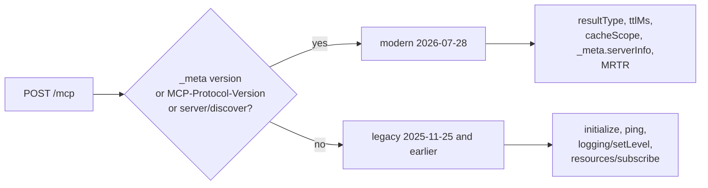

# Power MCP Template — MCP 2026-07-28

Build a Model Context Protocol server as a Power Platform custom connector. You write tools, resources, prompts, and Agent Skills; the built-in framework handles the protocol.

**Spec coverage: MCP 2026-07-28**, serving both protocol eras from one endpoint.

## Why This Revision Matters

Every previous version of this template carried a section titled *Stateless Limitations*, explaining which parts of MCP a Power Platform connector architecturally could not do. That section is gone.

MCP `2026-07-28` removed the `initialize` handshake, deleted the `Mcp-Session-Id` header, and made the protocol stateless: every request carries its own protocol version, client identity, and capabilities in `_meta`. A Power Platform custom connector is a stateless request-in / response-out function. For the first time, the runtime and the protocol agree.

The practical consequence is that a connector is no longer a compromised MCP host working around the spec. It is an ordinary one.

| Previously impossible here | Now |
|---|---|
| Session state across calls | The protocol has no sessions at all. State travels as explicit handles in tool arguments. |
| Elicitation / asking the user mid-call | Multi Round-Trip Requests. The server returns `input_required`; the client retries with answers. No open stream needed. |
| Version negotiation without a handshake | Per-request `_meta`, plus a `server/discover` RPC. |
| Cache-friendly tool catalogs | `ttlMs` and `cacheScope` on every list result, with deterministic ordering. |

Two things remain out of reach, both because a connector cannot hold a stream open: the `subscriptions/listen` notification stream, and the `io.modelcontextprotocol/tasks` extension.

## Dual-Era Serving

Copilot Studio is still a legacy client. It opens with `initialize` and knows nothing about `_meta`, `server/discover`, or `resultType`. The spec explicitly permits a server to answer both eras on one endpoint, and this template does.

The era is decided per request:

| Request carries | Era | Behavior |
|---|---|---|
| `params._meta["io.modelcontextprotocol/protocolVersion"]` | modern | Full `2026-07-28` semantics |
| `MCP-Protocol-Version` header | modern | Same |
| `method: "server/discover"` | modern | Answered regardless |
| none of the above | legacy | Byte-identical to the pre-`2026-07-28` template |

Modern-only fields — `resultType`, `ttlMs`, `cacheScope`, and `_meta.serverInfo` — are never added to a legacy response. That is what makes this upgrade safe to deploy against an existing Copilot Studio agent.



## What the Framework Handles

| You would otherwise write | Handled by the framework |
|---|---|
| JSON-RPC response helpers | Built into `McpRequestHandler` |
| Method routing and era detection | Built in |
| `server/discover` | Generated from `McpServerOptions` |
| `initialize` (legacy path) | Generated from the same options |
| Per-request `_meta` parsing | Surfaced as `McpRequestContext` |
| Protocol version negotiation and `UnsupportedProtocolVersionError` | Built in |
| `Mcp-Method` / `Mcp-Name` header validation | Built in |
| `resultType` on every result | Injected for modern callers |
| `ttlMs` / `cacheScope` cache hints | Injected per method |
| `tools/list`, `resources/list`, `prompts/list` | Built from your registrations, in deterministic order |
| `tools/call` dispatch and error wrapping | Built in |
| MRTR `input_required` plumbing | `InputRequired()` plus automatic legacy fallback |
| `skill://index.json` and skill resource routing | Generated from `AddSkill()` |
| Manual JSON Schema per tool | `McpSchemaBuilder` fluent API |

You write capability definitions. Nothing else.


## Quick Start

### 1. Configure the Server

`McpServerOptions` at the top of Section 1 drives `server/discover`, `initialize`, and the cache hints:

```csharp
private static readonly McpServerOptions Options = new McpServerOptions
{
    ServerInfo = new McpServerInfo
    {
        Name = "power-mcp-server",
        Version = "1.0.0",
        Title = "Power MCP Server",
        Description = "Power Platform custom connector implementing Model Context Protocol"
    },

    ProtocolVersion = "2026-07-28",
    SupportedProtocolVersions = new List<string> { "2026-07-28", "2025-11-25", "2025-06-18" },

    Capabilities = new McpCapabilities
    {
        Tools = true,
        Resources = true,
        Prompts = true,
        Completions = true
    },

    ListCacheTtlMs = 300000,
    ListCacheScope = "public",
    ResourceCacheTtlMs = 60000,
    ResourceCacheScope = "private",
    DiscoverCacheTtlMs = 3600000,

    Instructions = "" // Surfaced to the model by server/discover
};
```

Drop a revision from `SupportedProtocolVersions` and the server returns `UnsupportedProtocolVersionError` (`-32022`) with the list it does support, so the client can retry.

### 2. Define Your Capabilities

In the `RegisterCapabilities` method inside the `Script` class, add tools, resources, prompts, and skills:

```csharp
private void RegisterCapabilities(McpRequestHandler handler)
{
    handler.AddTool("echo", "Echoes back the provided message. Useful for testing connectivity.",
        schema: s => s.String("message", "The message to echo back", required: true),
        handler: async (args, ct) =>
        {
            return new JObject
            {
                ["echo"] = args.Value<string>("message") ?? "No message provided",
                ["timestamp"] = DateTime.UtcNow.ToString("o")
            };
        },
        annotations: a => { a["readOnlyHint"] = true; a["idempotentHint"] = true; });

    handler.AddResource("data://config/info", "Server Info", "Server configuration.",
        handler: async (ct) => new JArray
        {
            new JObject { ["uri"] = "data://config/info", ["mimeType"] = "application/json",
                ["text"] = new JObject { ["version"] = "1.0" }.ToString(Newtonsoft.Json.Formatting.Indented) }
        });

    handler.AddPrompt("summarize", "Summarize the given text.",
        arguments: new List<McpPromptArgument>
        {
            new McpPromptArgument { Name = "text", Description = "Text to summarize", Required = true }
        },
        handler: async (args, ct) => new JArray
        {
            new JObject { ["role"] = "user",
                ["content"] = new JObject { ["type"] = "text", ["text"] = $"Summarize: {args.Value<string>("text")}" } }
        });

    handler.AddSkill("expense-report",
        "File and validate employee expense reports according to company policy.",
        instructions: "1. Read the policy-limits resource.\n2. Validate each line item.",
        resources: r => r.Resource("references/policy-limits.md", "Spending caps.", () => limitsMarkdown));
}
```

### 3. Wire Up in ExecuteAsync

Already set up in the template. Note that the request is passed in so the framework can read the transport headers:

```csharp
public override async Task<HttpResponseMessage> ExecuteAsync()
{
    var handler = new McpRequestHandler(Options);
    RegisterCapabilities(handler);

    var body = await this.Context.Request.Content.ReadAsStringAsync().ConfigureAwait(false);
    var result = await handler.HandleAsync(
        body,
        McpTransportHeaders.FromRequest(this.Context.Request),
        this.CancellationToken).ConfigureAwait(false);

    return new HttpResponseMessage(HttpStatusCode.OK)
    {
        Content = new StringContent(result, Encoding.UTF8, "application/json")
    };
}
```

That's it. The handler does the rest.

## Discovery

`server/discover` is mandatory for servers on `2026-07-28`. The framework generates it from `McpServerOptions` — there is nothing to implement:

```json
{
  "jsonrpc": "2.0",
  "id": "discover-1",
  "result": {
    "resultType": "complete",
    "supportedVersions": ["2026-07-28", "2025-11-25", "2025-06-18"],
    "capabilities": { "tools": { "listChanged": false }, "resources": { "listChanged": false } },
    "instructions": "…",
    "ttlMs": 3600000,
    "cacheScope": "public",
    "_meta": {
      "io.modelcontextprotocol/serverInfo": { "name": "power-mcp-server", "version": "1.0.0" }
    }
  }
}
```

Clients are not obliged to call it — they can invoke any method directly and handle a version error — but it lets a client present your whole server from one round trip.

## Caching

`2026-07-28` requires cache hints on every `complete` result from `server/discover`, `tools/list`, `prompts/list`, `resources/list`, `resources/templates/list`, and `resources/read`. The framework attaches them automatically; you only choose the values.

| Setting | Applies to | Default |
|---|---|---|
| `ListCacheTtlMs` / `ListCacheScope` | the four list methods | 300000, `public` |
| `ResourceCacheTtlMs` / `ResourceCacheScope` | `resources/read` | 60000, `private` |
| `DiscoverCacheTtlMs` | `server/discover` | 3600000 |

`cacheScope` is a security decision, not just a performance one. `public` permits a shared gateway to serve one caller's cached response to another. Use `private` whenever the result depends on who is asking — which is why `resources/read` defaults to it. Tool and prompt lists are `public` by default because they are normally identical for everyone; if your `tools/list` varies by the caller's granted scopes, change `ListCacheScope` to `private`.

Tool ordering is deterministic (registration order), which is what makes list caching and upstream prompt caching worthwhile.


## Tool Registration

Register tools using `handler.AddTool()` inside the `RegisterCapabilities` method. Each tool needs a name, description, schema, and handler function:

```csharp
handler.AddTool("search_records", "Search records by keyword.",
    schema: s => s
        .String("query", "Search keyword", required: true)
        .Integer("top", "Max results to return", defaultValue: 10),
    handler: async (args, ct) =>
    {
        var query = args.Value<string>("query");
        var top = args.Value<int?>("top") ?? 10;
        // Your search logic here
        return new JObject { ["results"] = new JArray() };
    },
    annotations: a => { a["readOnlyHint"] = true; });
```

### Tool Title and Output Schema

Tools can declare a `title` for human-readable display and an `outputSchema` for structured content validation:

```csharp
handler.AddTool("get_weather", "Get current weather for a city.",
    schema: s => s.String("city", "City name", required: true),
    handler: async (args, ct) =>
    {
        return new JObject { ["city"] = args.Value<string>("city"), ["temp"] = 72 };
    },
    title: "Get Weather",
    outputSchemaConfig: o => o
        .String("city", "City name")
        .Number("temp", "Temperature in Fahrenheit"));
```

**What the framework does for you:**
- `inputSchema` is built from the `McpSchemaBuilder` calls
- Parameters marked `required: true` are added to the JSON Schema `required` array
- `defaultValue` on integer params sets the `default` in the schema
- Annotations map directly to [MCP tool annotations](https://modelcontextprotocol.io/specification/2025-11-25/server/tools#annotations) (`readOnlyHint`, `idempotentHint`, `openWorldHint`, etc.)
- Tool calls are dispatched by name to the matching handler
- Return values are wrapped in the MCP content response format automatically

### Schema Builder API

The `McpSchemaBuilder` supports all JSON Schema types:

```csharp
s.String("name", "description", required: true, format: "date", enumValues: new[] { "a", "b" })
s.Integer("count", "description", required: false, defaultValue: 10)
s.Number("price", "description", required: true)
s.Boolean("active", "description")
s.Array("items", "description", itemSchema: new JObject { ["type"] = "string" }, required: true)
s.Object("address", "Mailing address", nested => nested
    .String("street", "Street line", required: true)
    .String("city", "City", required: true)
    .String("zip", "ZIP code"), required: true)
```

A tool that declares no parameters gets `{ "type": "object", "additionalProperties": false }`, the spec's recommended empty-schema form.

#### Deliberately narrower than the spec allows

`2026-07-28` loosened `inputSchema` and `outputSchema` to permit any JSON Schema 2020-12 keyword, including `$ref` and `$defs`. This builder does not use them, and neither should a schema you hand-write.

The reason is Copilot Studio. Its [documented MCP limitations](https://learn.microsoft.com/microsoft-copilot-studio/mcp-troubleshooting) include four schema behaviors that are easy to trip over:

| Construct | What Copilot Studio does |
|---|---|
| `$ref` or any reference-type input | **Drops the tool entirely** from `tools/list`, silently |
| `"type": ["string", "null"]` | Truncates the schema |
| `exclusiveMinimum` as a number (2020-12 form) | Throws `System.FormatException` |
| `enum` | Accepts it, but treats the parameter as a plain string |

A dropped tool produces no error anywhere — it simply never appears. The builder therefore inlines nested objects rather than referencing them, and never emits a multi-type array. If you add numeric bounds, use the draft-04 boolean form of `exclusiveMinimum`.

## External API Calls

Tools that need to call external APIs can capture `ScriptBase` context via closures. Since `RegisterCapabilities` is an instance method on the `Script` class, you have access to `this.Context` and `this.CancellationToken`:

```csharp
private void RegisterCapabilities(McpRequestHandler handler)
{
    handler.AddTool("get_customer", "Retrieve a customer by ID.",
        schema: s => s.String("id", "Customer ID", required: true),
        handler: async (args, ct) =>
        {
            var id = args.Value<string>("id");
            var request = new HttpRequestMessage(HttpMethod.Get,
                $"https://api.example.com/customers/{id}");

            // Forward OAuth token from connector
            if (this.Context.Request.Headers.Authorization != null)
                request.Headers.Authorization = this.Context.Request.Headers.Authorization;

            var response = await this.Context.SendAsync(request, ct).ConfigureAwait(false);
            var content = await response.Content.ReadAsStringAsync().ConfigureAwait(false);
            return JObject.Parse(content);
        },
        annotations: a => { a["readOnlyHint"] = true; });
}
```

## Resource Registration

Resources expose data that MCP clients can read without invoking a tool. Register resources using `handler.AddResource()` for static (fixed URI) resources or `handler.AddResourceTemplate()` for dynamic (parameterized URI) resources.

### Static Resources

Static resources have a fixed URI and are listed directly in `resources/list`:

```csharp
handler.AddResource("data://config/server-info", "Server Info",
    "Current server configuration and version.",
    handler: async (ct) =>
    {
        return new JArray
        {
            new JObject
            {
                ["uri"] = "data://config/server-info",
                ["mimeType"] = "application/json",
                ["text"] = new JObject
                {
                    ["name"] = "my-server",
                    ["version"] = "1.0.0"
                }.ToString(Newtonsoft.Json.Formatting.Indented)
            }
        };
    });
```

### Resource Templates

Resource templates use [RFC 6570](https://tools.ietf.org/html/rfc6570) style URI templates with `{param}` placeholders. They're listed in `resources/templates/list` and resolved at read time:

```csharp
handler.AddResourceTemplate("data://customers/{id}", "Customer by ID",
    "Retrieve a customer record by ID.",
    handler: async (uri, ct) =>
    {
        var p = McpRequestHandler.ExtractUriParameters("data://customers/{id}", uri);
        var id = p["id"];

        // Fetch from API, database, etc.
        return new JArray
        {
            new JObject
            {
                ["uri"] = uri,
                ["mimeType"] = "application/json",
                ["text"] = new JObject { ["id"] = id, ["name"] = "Contoso" }
                    .ToString(Newtonsoft.Json.Formatting.Indented)
            }
        };
    });
```

### Resource Content Format

Resource handlers return a `JArray` of content objects. Each object has:

| Field | Required | Description |
|---|---|---|
| `uri` | Yes | The resource URI |
| `mimeType` | Yes | MIME type of the content |
| `text` | One of these | Text content (for text-based resources) |
| `blob` | One of these | Base64-encoded binary content |

### AddResource Parameters

| Parameter | Required | Default | Description |
|---|---|---|---|
| `uri` | Yes | — | Fixed resource URI |
| `name` | Yes | — | Human-readable name for the resource |
| `description` | Yes | — | Description of the resource |
| `handler` | Yes | — | `Func<CancellationToken, Task<JArray>>` returning content |
| `mimeType` | No | `application/json` | MIME type of the resource content |
| `annotationsConfig` | No | null | Optional audience/priority annotations |

### AddResourceTemplate Parameters

| Parameter | Required | Default | Description |
|---|---|---|---|
| `uriTemplate` | Yes | — | URI template with `{param}` placeholders |
| `name` | Yes | — | Human-readable name for the template |
| `description` | Yes | — | Description of the template |
| `handler` | Yes | — | `Func<string, CancellationToken, Task<JArray>>` receiving the resolved URI |
| `mimeType` | No | `application/json` | MIME type of the resource content |
| `annotationsConfig` | No | null | Optional audience/priority annotations |

### ExtractUriParameters Helper

Use `McpRequestHandler.ExtractUriParameters()` inside resource template handlers to extract named parameters:

```csharp
// Template: "data://items/{category}/{id}"
// URI:      "data://items/electronics/42"
var p = McpRequestHandler.ExtractUriParameters("data://items/{category}/{id}", uri);
// p["category"] = "electronics"
// p["id"] = "42"
```

## Prompt Registration

Prompts expose reusable message templates that MCP clients can retrieve via `prompts/list` and `prompts/get`. Register prompts using `handler.AddPrompt()` inside `RegisterCapabilities`.

### Basic Prompt

```csharp
handler.AddPrompt("summarize", "Summarize the given text concisely.",
    arguments: new List<McpPromptArgument>
    {
        new McpPromptArgument { Name = "text", Description = "The text to summarize", Required = true },
        new McpPromptArgument { Name = "style", Description = "Summary style: brief, detailed, or bullets", Required = false }
    },
    handler: async (args, ct) =>
    {
        var text = args.Value<string>("text") ?? "";
        var style = args.Value<string>("style") ?? "brief";

        return new JArray
        {
            new JObject
            {
                ["role"] = "user",
                ["content"] = new JObject
                {
                    ["type"] = "text",
                    ["text"] = $"Please provide a {style} summary of the following text:\n\n{text}"
                }
            }
        };
    });
```

### Multi-Turn Prompt

Prompts can return multiple messages to set up a conversation:

```csharp
handler.AddPrompt("code_review", "Review code for issues and improvements.",
    arguments: new List<McpPromptArgument>
    {
        new McpPromptArgument { Name = "code", Description = "The code to review", Required = true },
        new McpPromptArgument { Name = "language", Description = "Programming language", Required = false }
    },
    handler: async (args, ct) =>
    {
        var code = args.Value<string>("code") ?? "";
        var language = args.Value<string>("language") ?? "unknown";

        return new JArray
        {
            new JObject
            {
                ["role"] = "user",
                ["content"] = new JObject { ["type"] = "text",
                    ["text"] = $"Please review the following {language} code for bugs, security issues, and improvements:\n\n```{language}\n{code}\n```" }
            },
            new JObject
            {
                ["role"] = "assistant",
                ["content"] = new JObject { ["type"] = "text",
                    ["text"] = "I'll review this code for bugs, security issues, and potential improvements. Let me analyze it section by section." }
            }
        };
    });
```

### Prompt Message Format

Prompt handlers return a `JArray` of message objects. Each message has:

| Field | Required | Values |
|---|---|---|
| `role` | Yes | `"user"` or `"assistant"` |
| `content` | Yes | Object with `type` and `text` fields |

### AddPrompt Parameters

| Parameter | Required | Description |
|---|---|---|
| `name` | Yes | Prompt identifier (snake_case) |
| `description` | Yes | AI-readable description of the prompt's purpose |
| `arguments` | Yes | `List<McpPromptArgument>` describing accepted parameters |
| `handler` | Yes | `Func<JObject, CancellationToken, Task<JArray>>` returning messages |

### McpPromptArgument Properties

| Property | Type | Description |
|---|---|---|
| `Name` | string | Argument name |
| `Description` | string | Human-readable description |
| `Required` | bool | Whether the argument must be provided |

## Agent Skills

An [Agent Skill](https://agentskills.io/) is a portable package of instructions and resources that an agent loads on demand. `AddSkill()` publishes one over MCP, so a connector becomes a distribution point for skills that [Microsoft Agent Framework](https://learn.microsoft.com/en-us/agent-framework/agents/skills?pivots=programming-language-csharp#mcp-based-skills) agents and Microsoft Foundry Toolbox pull at runtime.

This adds no protocol surface. Skills are ordinary MCP resources under the `skill://` scheme.

```csharp
handler.AddSkill("expense-report",
    "File and validate employee expense reports according to company policy. " +
    "Use when asked about expense submissions, reimbursement rules, or spending limits.",
    instructions: @"Use this skill when the user asks about filing or validating an expense report.

1. Read the `policy-limits` resource for the current per-category spending caps.
2. Validate each line item against those caps.
3. Flag any item that exceeds a cap and state which rule it breaks.",
    resources: r => r
        .Resource("references/policy-limits.md", "Per-category spending caps.", () => limitsMarkdown)
        .Resource("assets/report-template.md", "Blank expense report template.", () => templateMarkdown),
    license: "Apache-2.0",
    compatibility: "Requires network access to the Contoso Finance API.");
```

That one call generates three resources:

| URI | Contents |
|---|---|
| `skill://index.json` | Discovery document, one `skill-md` entry per registered skill |
| `skill://expense-report/SKILL.md` | YAML frontmatter plus the markdown body |
| `skill://expense-report/references/policy-limits.md` | Sibling resource, served on `resources/read` |

### Consuming the skills

```csharp
await using McpClient client = await McpClient.CreateAsync(transport);

var skillsProvider = new AgentSkillsProviderBuilder()
    .UseMcpSkills(client)
    .Build();
```

Python agents use `MCPSkillsSource`. Because the skill lives on the server, editing the instructions here updates every connected agent without redeploying any of them.

### AddSkill Parameters

| Parameter | Required | Constraint |
|---|---|---|
| `name` | Yes | Lowercase letters, digits, and single hyphens. Max 64 characters. No leading, trailing, or consecutive hyphen. |
| `description` | Yes | What it does and when to use it. Max 1024 characters. Include the keywords an agent would match on. |
| `instructions` | Yes | The markdown body. Keep under 500 lines and move detail into resources. |
| `resources` | No | Sibling files the instructions reference |
| `license` | No | License name or reference |
| `compatibility` | No | Environment requirements. Max 500 characters. |
| `metadata` | No | Arbitrary key-value map |

Every constraint is enforced at registration, so a malformed skill throws when the connector loads rather than failing silently at discovery time.

### Scope

Only the `skill-md` distribution type is produced. Archive-type skills are not generated: the Python source ignores them, and the .NET client never executes scripts bundled in a remote archive anyway. The Agent Framework MCP skills API is marked experimental and may change.

## Rich Content Types

By default, tool handlers return a `JObject` which is automatically wrapped in a `text` content item. To return image, audio, resource, or mixed content, use the static content helpers and `McpRequestHandler.ToolResult()`:

```csharp
handler.AddTool("get_chart", "Generate a chart image.",
    schema: s => s.String("metric", "Metric to chart", required: true),
    handler: async (args, ct) =>
    {
        var imageBytes = await GenerateChartAsync(args.Value<string>("metric"));
        var base64 = Convert.ToBase64String(imageBytes);

        return McpRequestHandler.ToolResult(new JArray
        {
            McpRequestHandler.TextContent("Here is the chart:"),
            McpRequestHandler.ImageContent(base64, "image/png")
        });
    });
```

### Content Helpers

| Helper | Content Type | Parameters |
|---|---|---|
| `TextContent(text)` | `text` | Plain text string |
| `ImageContent(base64Data, mimeType)` | `image` | Base64-encoded image data |
| `AudioContent(base64Data, mimeType)` | `audio` | Base64-encoded audio data |
| `ResourceContent(uri, text, mimeType)` | `resource` | Embedded resource with URI |
| `ResourceLinkContent(uri, name, description, mimeType)` | `resource_link` | Points at a resource instead of embedding it |

### Structured Content

Return `structuredContent` alongside content for tools that declare an `outputSchema`:

```csharp
handler.AddTool("get_weather", "Get weather data.",
    schema: s => s.String("city", "City name", required: true),
    handler: async (args, ct) =>
    {
        var data = new JObject { ["city"] = "Seattle", ["temp"] = 65 };
        return McpRequestHandler.ToolResult(
            content: new JArray { McpRequestHandler.TextContent("65°F in Seattle") },
            structuredContent: data);
    },
    outputSchemaConfig: o => o
        .String("city", "City name")
        .Number("temp", "Temperature"));
```

## Multi Round-Trip Requests

MRTR is how `2026-07-28` replaced server-initiated `elicitation/create`, `sampling/createMessage`, and `roots/list`. Instead of the server pushing a request down an open stream, it returns `resultType: "input_required"` and the client **retries the original call** with the answers attached.

That inversion is what makes elicitation possible from a Power Platform connector for the first time. There is no stream to hold open and no session to keep — just two ordinary request/response exchanges.

```csharp
handler.AddTool("delete_records", "Permanently delete matching records.",
    schema: s => s.String("filter", "Records to delete", required: true),
    handler: async (args, ct) =>
    {
        var filter = args.Value<string>("filter");

        // Nothing was confirmed yet — ask, and stash what we need to resume.
        return McpRequestHandler.InputRequired(
            new JObject
            {
                ["confirm"] = McpRequestHandler.ElicitationRequest(
                    $"Permanently delete all records matching '{filter}'?",
                    s => s.Boolean("proceed", "Confirm deletion", required: true))
            },
            requestState: filter);
    });
```

The client retries the same `tools/call` with `inputResponses` and `requestState`, which arrive on the request context:

```csharp
handler: async (args, ct) =>
{
    var answered = ctx.InputResponses?["confirm"]?["content"]?["proceed"]?.Value<bool>() == true;
    var filter = ctx.RequestState; // what we stashed on the first pass
    ...
}
```

Because the server holds nothing between the two calls, **anything you need to resume must go in `requestState`**. Treat it as opaque to the client and do not put secrets in it — it round-trips through the caller.

### Legacy fallback

Legacy clients cannot interpret `resultType`. Rather than emitting a shape Copilot Studio would fail to parse, the framework converts an `input_required` into a tool error naming the missing input, so the model can ask for it as a normal argument instead. You get one code path and a sensible degradation.

## Error Handling

### From Tool Methods

```csharp
// Structured MCP error (logged, returned as tool error)
throw new McpException(McpErrorCode.InvalidParams, "'id' is required");

// Argument validation (returned as tool error)
throw new ArgumentException("ID must be a valid GUID");

// Any other exception (returned as tool error, logged)
throw new Exception("External API unavailable");
```

All exceptions from tools are returned as MCP tool results with `isError: true`, not as protocol-level errors. This lets the AI understand and react to failures.

### McpErrorCode Values

| Code | Name | Use |
|---|---|---|
| -32700 | ParseError | Malformed JSON |
| -32600 | InvalidRequest | Missing required fields |
| -32601 | MethodNotFound | Unknown method, or one removed in 2026-07-28 |
| -32602 | InvalidParams | Bad tool arguments, or resource not found |
| -32603 | InternalError | Unhandled exception |
| -32000 | RequestTimeout | Legacy range. Retained; do not allocate new codes here. |
| -32020 | HeaderMismatch | `Mcp-Method` or `Mcp-Name` disagrees with the body |
| -32021 | MissingRequiredClientCapability | Client did not declare a capability the request needs |
| -32022 | UnsupportedProtocolVersion | Requested revision is not in `SupportedProtocolVersions` |

`2026-07-28` partitioned the JSON-RPC implementation-defined range: `-32000` to `-32019` is legacy and frozen, `-32020` to `-32099` belongs to the specification. Resource-not-found also moved from `-32002` to `-32602`.

## Application Insights (Optional)

Wire up telemetry via the `OnLog` callback:

```csharp
handler.OnLog = (eventName, data) =>
{
    this.Context.Logger.LogInformation($"[{correlationId}] {eventName}");
    _ = LogToAppInsights(eventName, data, correlationId);
};
```

The handler emits these events:

| Event | When |
|---|---|
| McpRequestReceived | Every incoming request, tagged with the detected era |
| McpDiscovered | server/discover served |
| McpInitialized | After a successful legacy initialize |
| McpUnsupportedProtocolVersion | Requested revision rejected |
| McpHeaderMismatch | Mcp-Method or Mcp-Name disagreed with the body |
| McpMethodRemoved | Modern client called a method removed in 2026-07-28 |
| McpToolsListed | tools/list served |
| McpResourcesListed | resources/list served |
| McpResourceTemplatesListed | resources/templates/list served |
| McpResourceReadStarted | Before resource read |
| McpResourceReadCompleted | After successful resource read |
| McpResourceReadError | Resource read failed |
| McpPromptsListed | prompts/list served |
| McpPromptGetStarted | Before prompt get |
| McpPromptGetCompleted | After successful prompt get |
| McpPromptGetError | Prompt get failed |
| McpToolCallStarted | Before tool execution |
| McpToolCallCompleted | After successful tool execution |
| McpToolCallError | Tool execution failed |
| McpInputRequired | Tool returned an MRTR input_required result |
| McpInputRequiredUnsupported | MRTR degraded because the caller is a legacy client |
| McpMethodNotFound | Unknown method received |
| McpError | Protocol-level error |

`McpRequestReceived` carries the era and negotiated version, which is the fastest way to confirm in production whether a given client is being served as modern or legacy.

## File Structure

```
Power MCP Template/
├── script.csx                  # Framework + entry point with your definitions
├── apiDefinition.swagger.json  # OpenAPI definition, single POST at /mcp/
├── apiProperties.json          # Connector metadata and script wiring
├── copilot-instructions.md     # Guidance for AI agents editing this template
└── readme.md                   # This file
```

The script is organized into two clearly marked sections:

1. **Section 1: Connector Entry Point** — Server config, `RegisterCapabilities` with your tool, resource, prompt, and skill definitions, the `ExecuteAsync` entry point, and optional Application Insights logging.
2. **Section 2: MCP Framework** — `McpRequestHandler`, `McpSchemaBuilder`, and supporting types. Don't modify unless extending the framework itself.

## Connector Setup

Both connector files ship with the template and are ready to deploy once you set `host`.

### apiDefinition.swagger.json

The MCP-only contract: `basePath` of `/mcp` with the operation at `/`.

```json
{
  "swagger": "2.0",
  "info": {
    "title": "Power MCP Server",
    "description": "Model Context Protocol server built as a Power Platform custom connector.",
    "version": "1.0.0"
  },
  "host": "your-api-host.com",
  "basePath": "/mcp",
  "schemes": ["https"],
  "consumes": ["application/json"],
  "produces": ["application/json"],
  "paths": {
    "/": {
      "post": {
        "summary": "Invoke MCP Server",
        "x-ms-agentic-protocol": "mcp-streamable-1.0",
        "operationId": "InvokeMCP",
        "responses": {
          "200": { "description": "Success" }
        }
      }
    }
  },
  "securityDefinitions": {}
}
```

### apiProperties.json

```json
{
    "properties": {
        "connectionParameters": {},
        "iconBrandColor": "#0078d4",
        "capabilities": [
            "actions"
        ],
        "publisher": "Troy Taylor",
        "scriptOperations": [
            "InvokeMCP"
        ]
    }
}
```

The MCP operation must have **no `parameters` key at all**, not even an empty array. Power Platform injects its own body parameter and a declared one collides with it.

## Copilot Studio Compatibility

Copilot Studio is the most common consumer of this template and the most constrained. Everything here is from its [MCP documentation](https://learn.microsoft.com/microsoft-copilot-studio/agent-extend-action-mcp) and [troubleshooting guide](https://learn.microsoft.com/microsoft-copilot-studio/mcp-troubleshooting).

| Constraint | Consequence for this template |
|---|---|
| Supports **tools and resources only** — not prompts | `AddPrompt` still works and other clients consume it, but nothing you register there reaches a Copilot Studio agent |
| Legacy protocol era | Served automatically. Do not remove the legacy branch. |
| Streamable HTTP only, SSE dropped after August 2025 | `x-ms-agentic-protocol: mcp-streamable-1.0`, already set |
| Requires **generative orchestration** enabled | Turn it on in the agent, or the MCP tool never fires |
| `$ref` in a tool schema drops the tool silently | The schema builder never emits one |
| Multi-type arrays truncate the schema | The builder never emits one |
| Numeric `exclusiveMinimum` throws | Use the draft-04 boolean form |
| `enum` degrades to plain string | Harmless; still worth declaring |
| Tool descriptions can't be enriched per agent | Write the description for the model on the server side |
| Topics cannot call MCP servers directly | Reach them through generative orchestration |

### Getting it into an agent

| Path | When |
|---|---|
| **MCP wizard** — Tools → Add a tool → Model Context Protocol | Fastest for a single agent |
| **Custom connector** via Power Apps | When you need connector-level auth, DLP, or solution packaging |
| **Agents 365 BYO MCP server** — Agents 365 CLI, then M365 admin center → Agents → Tools → Registry | Tenant-wide governance, with Block/Unblock per tool |

For cross-tenant distribution, [submit the connector for certification](https://learn.microsoft.com/en-us/connectors/custom-connectors/submit-certification).

## Relationship to Official MCP C# SDK

This template mirrors the concepts from the [official SDK](https://github.com/modelcontextprotocol/csharp-sdk), adapted for Power Platform's sandbox:

| Official SDK | This template |
|---|---|
| `McpServerOptions` | `McpServerOptions` |
| `IMcpServer` + DI | `McpRequestHandler` (no DI) |
| `McpException` | `McpException` (same pattern) |
| `builder.Services.AddMcpServer()` | `new McpRequestHandler(options)` |
| `app.MapMcp()` | `handler.HandleAsync(body, headers, ct)` |
| `[McpServerTool]` + reflection | `handler.AddTool()` fluent API |
| `[McpServerResource]` + reflection | `handler.AddResource()` / `handler.AddResourceTemplate()` |
| `[McpServerPrompt]` + reflection | `handler.AddPrompt()` |
| `UseMcpSkills` on the client side | `handler.AddSkill()` on the server side |

The official SDK uses attribute-based discovery via `System.Reflection`. Power Platform [does not support](https://learn.microsoft.com/en-us/connectors/custom-connectors/write-code#supported-namespaces) `System.Reflection` or `System.ComponentModel`, so this template uses fluent registration instead.

## MCP 2026-07-28 Spec Coverage

### Modern era

| Method | Notes |
|---|---|
| `server/discover` | Supported versions, capabilities, identity, cache hints |
| `tools/list` | `title`, `outputSchema`, `annotations`, deterministic order, cache hints |
| `tools/call` | Text, image, audio, resource, `resource_link`, `structuredContent`, and `input_required` |
| `resources/list` | Built from `AddResource`, cache hints |
| `resources/templates/list` | Built from `AddResourceTemplate`, cache hints |
| `resources/read` | Dispatched to resource, template, or `skill://` handler, cache hints |
| `prompts/list` / `prompts/get` | Built from `AddPrompt` |
| `completion/complete` | Empty completions |
| `notifications/cancelled` | Acknowledged |

Every modern result carries `resultType` and `_meta["io.modelcontextprotocol/serverInfo"]`.

**Removed in 2026-07-28**, and reported to a modern caller as such: `initialize`, `notifications/initialized`, `notifications/roots/list_changed`, `ping`, `logging/setLevel`, `resources/subscribe`, `resources/unsubscribe`.

### Legacy era

The handshake path is unchanged from the previous revision: `initialize`, `initialized`, `ping`, `logging/setLevel`, `resources/subscribe` / `unsubscribe`, and all notification acknowledgments still behave exactly as before, with none of the modern fields added.

### Still out of reach

Only two things, both because a connector cannot hold a stream open:

| Feature | Why |
|---|---|
| `subscriptions/listen` and server-to-client notifications | Requires a long-lived response stream |
| The `io.modelcontextprotocol/tasks` extension | Requires durable state across requests |

Note what is **no longer** on this list: sessions (the protocol dropped them), and elicitation (MRTR replaced the stream with a retry).

## Revision History

This template is versioned by the MCP revision it implements rather than by semver.

### 2026-07-28

- Dual-era serving: modern and legacy clients on one endpoint
- `server/discover`, per-request `_meta`, `resultType`, `UnsupportedProtocolVersionError`
- `ttlMs` / `cacheScope` cache hints and deterministic list ordering
- `Mcp-Method` / `Mcp-Name` header validation with `HeaderMismatch`
- Multi Round-Trip Requests via `InputRequired()` and `ElicitationRequest()`
- Agent Skills over MCP via `AddSkill()` and generated `skill://index.json`
- `ResourceLinkContent` helper; `structuredContent` accepts any JSON value
- Error codes `-32020` / `-32021` / `-32022`; resource-not-found moved to `-32602`
- Schema builder hardened against the four documented Copilot Studio schema defects
- `apiDefinition.swagger.json` and `apiProperties.json` now ship with the template
- **Fix:** `AddTool` declared `schemaConfig` / `annotationsConfig` while every call site and both doc files used `schema:` / `annotations:`. The parameters are now named `schema` and `annotations`.

### 2025-11-25

- `AddResource`, `AddResourceTemplate`, and `AddPrompt` registration APIs
- Tool `title` and `outputSchema`, rich content helpers

### Earlier

- Fluent `AddTool` API and the built-in `McpRequestHandler` framework, replacing hand-written protocol routing

## License

MIT License - feel free to use and modify for your projects.
