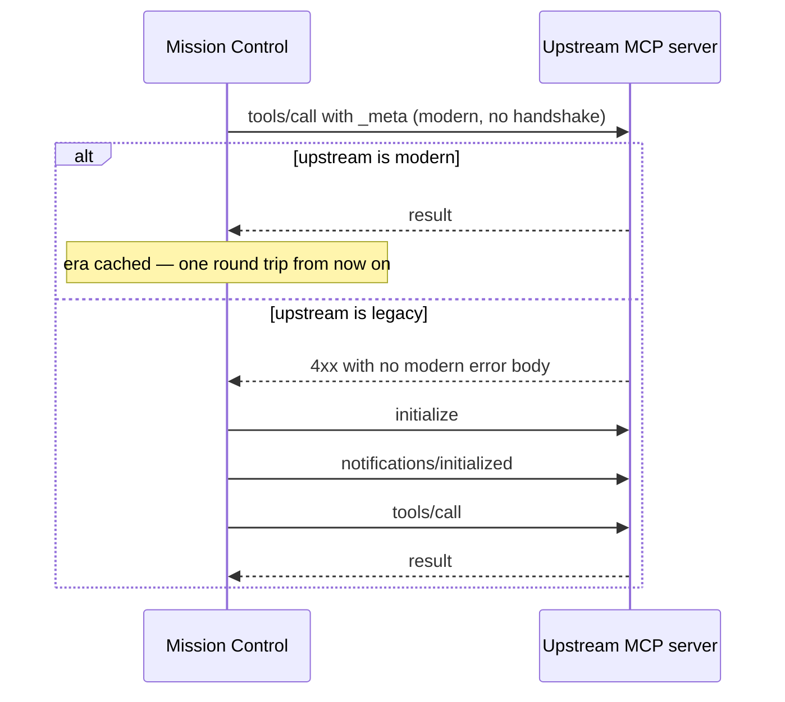

# Power Mission Control Template — MCP 2026-07-28

Progressive API discovery for Copilot Studio agents. Instead of registering dozens of typed tools (which consume context window tokens), this template exposes **3 mission control tools** that cover any API surface:

- **`scan_{service}`** — Scan for available operations by intent
- **`launch_{service}`** — Launch any API endpoint with auth forwarding
- **`sequence_{service}`** — Launch a sequence of multiple operations in one call

It is built on the same framework as the [Power MCP Template](../Power%20MCP%20Template/readme.md) — read that for the full protocol reference. This document covers what mission control adds on top.

## Token Impact

| Approach | 30-operation API | tools/list tokens |
|---|---|---|
| Typed tools | 30 tools × ~500 tokens | ~15,000 |
| **Mission Control** | **3 tools** | **~1,500** |

The planner pulls operation details on demand via `scan`, so full schemas are never injected upfront. As of `2026-07-28` that catalog is also cacheable and deterministically ordered, so a client can hold it across reconnects instead of re-fetching.

## Both a Server and a Client

Mission control is unusual among MCP connectors: in `McpChain` discovery mode it is **also an MCP client**, calling out to an external MCP server to search documentation.

`2026-07-28` matters on both sides.

**As a server**, it is dual-era. A request carrying `_meta` protocol version, an `MCP-Protocol-Version` header, or calling `server/discover` is served modern; everything else, Copilot Studio included, is served exactly as before. See the base template's readme for the full behavior.

**As a client**, `McpChainClient` negotiates the upstream server's era:



Two things fall out of this:

- The happy path drops from **three HTTP round trips to one**, inside a code path that already needed a cache because it was slow.
- A recognized modern error (`-32020`, `-32021`, `-32022`) means the upstream *is* modern and simply refused that request, so the client does **not** fall back. Anything else on a `4xx` identifies a legacy server. Era is cached per endpoint, so the probe is paid once.

This matters immediately: the documented default `McpChainEndpoint` is MS Learn MCP, and Microsoft shipped `2026-07-28` support on day zero. Under the old code, a modern upstream would have broken `McpChain` outright.

## Discovery Modes

### Static (default)
Embedded capability index in `script.csx`. The author curates a JSON array of operations at build time. No external calls needed.

**Best for:** APIs with no describe endpoints and limited documentation. Any API works.

### Hybrid
Embedded index for operation discovery + live API describe/metadata calls for field schemas. Describe results are cached (default 30 min).

**Best for:** APIs with runtime metadata endpoints (Salesforce `/describe`, Shopify introspection).

### McpChain
External MCP server for documentation search (e.g., MS Learn MCP for Microsoft Graph). Results are cached (default 10 min). Uses the dual-era client described above.

**Best for:** APIs backed by searchable documentation services.

## Quick Start

### 1. Configure `MissionControlOptions`

In Section 1 of `script.csx`, set your service name and base URL:

```csharp
private static readonly MissionControlOptions McOptions = new MissionControlOptions
{
    ServiceName = "salesforce",
    BaseApiUrl = "https://your-instance.salesforce.com/services/data/v66.0",
    DiscoveryMode = DiscoveryMode.Static,
    MaxDiscoverResults = 3,
};
```

### 2. Review `McpServerOptions`

The protocol-level settings sit alongside it:

```csharp
ProtocolVersion = "2026-07-28",
SupportedProtocolVersions = new List<string> { "2026-07-28", "2025-11-25", "2025-06-18" },

ListCacheTtlMs = 900000,   // 15 min — the three tools are stable
ListCacheScope = "public",
DiscoverCacheTtlMs = 3600000,

Instructions = "Call scan_{service} first to find the operation you need, then launch_{service} to execute it."
```

`Instructions` is worth filling in. `server/discover` returns it, so it is the one place you can tell the model how to drive the three tools before it has called anything.

### 3. Build Your Capability Index

Use the companion `generate-capability-index.prompt.md` to create the index from your API docs:

1. Open `generate-capability-index.prompt.md` in VS Code
2. Paste your API documentation (Swagger, Postman, or text)
3. Copilot generates the JSON array
4. Review and paste into `CAPABILITY_INDEX` in `script.csx`

### 4. Configure Auth

Update `apiDefinition.swagger.json` with your API host and auth, and `apiProperties.json` with matching connection parameters.

### 5. Deploy

Deploy as a custom connector in Power Platform. Add to your Copilot Studio agent, which requires [generative orchestration](https://learn.microsoft.com/microsoft-copilot-studio/advanced-generative-actions) to be enabled.

## Files

| File | Purpose |
|---|---|
| `script.csx` | Connector logic — Section 1 (your config) + Section 2 (framework + orchestration engine) |
| `apiDefinition.swagger.json` | OpenAPI definition — single POST at `/mcp/` |
| `apiProperties.json` | Connector metadata and auth config |
| `generate-capability-index.prompt.md` | Copilot prompt for generating capability indexes |

## Architecture

```
Copilot Studio Planner
    │
    ├─ tools/list → [scan_myservice, launch_myservice, sequence_myservice]
    │                (~1,500 tokens, + ttlMs/cacheScope so it can be cached)
    │
    ├─ tools/call: scan_myservice({query: "create customer"})
    │   ├─ Static:   search embedded CapabilityIndex → return matches
    │   ├─ Hybrid:   search index + call API /describe → return matches + live schema
    │   └─ McpChain: dual-era call to external MCP server → parse docs → return operations
    │
    ├─ tools/call: launch_myservice({endpoint: "/customers", method: "POST", body: {...}})
    │   ├─ Build URL from BaseApiUrl + endpoint
    │   ├─ Forward Authorization header (OBO token)
    │   ├─ Apply smart defaults ($top, Content-Type, Accept)
    │   ├─ Handle 429 retry (up to 3 with Retry-After)
    │   ├─ Translate 401/403/404 to friendly errors
    │   └─ Summarize response (strip HTML, truncate)
    │
    └─ tools/call: sequence_myservice({requests: [...]})
        ├─ Sequential: execute one at a time, in order
        └─ BatchEndpoint: single POST to $batch path
```

## Configuration Reference

### MissionControlOptions

| Property | Default | Description |
|---|---|---|
| `ServiceName` | `"api"` | Used in tool names: `scan_{ServiceName}` |
| `DiscoveryMode` | `Static` | `Static`, `Hybrid`, or `McpChain` |
| `BaseApiUrl` | — | Base URL for all API calls |
| `DefaultApiVersion` | — | API version appended to URL |
| `BatchMode` | `Sequential` | `Sequential` or `BatchEndpoint` |
| `BatchEndpointPath` | `"/$batch"` | Path for native batch endpoint |
| `MaxBatchSize` | `20` | Max requests per sequence |
| `DefaultPageSize` | `25` | Auto-injected `$top` for GET collections |
| `CacheExpiryMinutes` | `10` | Discovery cache TTL |
| `DescribeCacheTTL` | `30` | Describe/metadata cache TTL (Hybrid) |
| `MaxDiscoverResults` | `3` | Max operations returned by discover |
| `SummarizeResponses` | `true` | Enable HTML stripping and truncation |
| `MaxBodyLength` | `500` | Max chars for body fields |
| `MaxTextLength` | `1000` | Max chars for text fields |
| `DescribeEndpointPattern` | — | Hybrid: describe path with `{resource}` |
| `McpChainEndpoint` | — | McpChain: external MCP server URL |
| `McpChainToolName` | — | McpChain: tool to call on external server |
| `McpChainQueryPrefix` | — | McpChain: prefix for search queries |
| `SmartDefaults` | — | Author-defined per-endpoint defaults |

### Capability Entry Fields

| Field | Required | Description |
|---|---|---|
| `cid` | Yes | Unique operation identifier (snake_case) |
| `endpoint` | Yes | API path with `{param}` placeholders |
| `method` | Yes | HTTP method (GET/POST/PATCH/PUT/DELETE) |
| `outcome` | Yes | AI-readable description (~1 sentence) |
| `domain` | Yes | Category tag (e.g., "crm", "billing") |
| `requiredParams` | No | Required parameter names |
| `optionalParams` | No | Optional parameter names |
| `schemaJson` | No | Full JSON Schema for input parameters |

## Compatibility

Everything the base template supports works here unchanged: `AddTool()`, `AddResource()`, `AddResourceTemplate()`, `AddPrompt()`, and `AddSkill()` can be used instead of or alongside mission control mode.

### Confirming a destructive launch

`launch` and `sequence` can execute writes and deletes. With `2026-07-28` you can ask before acting, from a stateless connector, using a Multi Round-Trip Request:

```csharp
handler.AddTool("launch_guarded", "Launch an operation, confirming destructive methods first.",
    schema: s => s
        .String("endpoint", "API endpoint path", required: true)
        .String("method", "HTTP method", required: true),
    handler: async (args, ct) =>
    {
        var method = args.Value<string>("method");
        if (method == "DELETE")
        {
            return McpRequestHandler.InputRequired(
                new JObject
                {
                    ["confirm"] = McpRequestHandler.ElicitationRequest(
                        $"Confirm {method} on {args.Value<string>("endpoint")}?",
                        s => s.Boolean("proceed", "Confirm", required: true))
                },
                requestState: args.Value<string>("endpoint"));
        }
        // ...
    });
```

Legacy clients degrade to a tool error naming the confirmation they cannot supply, so nothing executes unconfirmed either way.

## Custom Tools

You can add typed tools alongside mission control tools:

```csharp
private void RegisterCustomTools(McpRequestHandler handler)
{
    handler.AddTool("get_limits", "Get current API usage limits.",
        schema: s => { },
        handler: async (args, ct) =>
        {
            return await SendExternalRequestAsync(HttpMethod.Get, $"{McOptions.BaseApiUrl}/limits");
        });
}
```

These appear in `tools/list` alongside the 3 mission control tools. A tool with no parameters gets `{ "type": "object", "additionalProperties": false }` automatically.

## Smart Defaults

Add domain-specific parameter injection:

```csharp
McOptions.SmartDefaults = new Dictionary<string, Action<string, JObject>>
{
    ["/calendar"] = (endpoint, queryParams) =>
    {
        if (queryParams["startDate"] == null)
            queryParams["startDate"] = DateTime.UtcNow.Date.ToString("yyyy-MM-dd");
    },
    ["/events"] = (endpoint, queryParams) =>
    {
        if (queryParams["$orderby"] == null)
            queryParams["$orderby"] = "start/dateTime";
    }
};
```

## Mission Control vs Typed Tools

Both patterns ship on the same framework. This compares the two approaches, not two product versions.

### Architecture

| | Typed tools | Mission control |
|---|---|---|
| **Pattern** | One `AddTool()` per API operation | 3 tools: scan, launch, sequence |
| **Tool count** | Grows with API surface (10–50+) | Fixed at 3 (+ optional custom tools) |
| **Discovery** | `tools/list` dumps all schemas upfront | Progressive: the planner scans first |
| **Schema delivery** | Full JSON Schema per tool, always loaded | On demand via `include_schema=true` |
| **API coverage** | Only operations you explicitly register | Any endpoint via generic launch |

### Token Budget (30-operation API)

| | Typed tools | Mission control |
|---|---|---|
| `tools/list` payload | ~15,000 tokens | ~1,500 tokens |
| Per-interaction cost | 0 (schemas pre-loaded) | ~200–400 (scan call) |
| Net saving | — | **~90% on initial load** |

### Developer Experience

| | Typed tools | Mission control |
|---|---|---|
| **User code** | ~10–20 lines per tool × N tools | ~60–80 lines total (configure + index) |
| **Adding operations** | Write a new `AddTool()` with schema | Add an entry to `CAPABILITY_INDEX` |
| **Auth handling** | Manual per tool | Automatic via `ApiProxy` auth forwarding |
| **Error handling** | Manual per tool | Built-in hybrid errors (`friendlyMessage` + `suggestion`) |
| **Response processing** | Manual per tool | Built-in summarization (HTML strip, truncate) |
| **Retry logic** | Manual per tool | Built-in 429 retry with Retry-After |
| **Pagination** | Manual per tool | Built-in `$top` injection + `nextLink` detection |
| **Sequenced operations** | Not supported | Built-in sequential or `$batch` endpoint |

### When to Use Each

**Use typed tools** when:
- You have a small, fixed set of operations (≤5 tools)
- Each tool has complex, unique logic that doesn't fit a generic proxy pattern
- You need fine-grained control over each tool's schema and behavior
- The API requires different auth or processing per operation

**Use mission control** when:
- The API has 10+ operations (token savings become significant)
- Operations follow standard REST patterns (CRUD on resources)
- You want to cover the entire API surface without registering every endpoint
- You want built-in retry, pagination, error handling, and response summarization
- The API may evolve — adding operations means updating the index, not writing code

**Mix both** when:
- Most operations are standard REST but a few need custom logic
- You want mission control for discovery and launch, plus specific high-value tools exposed directly

## Revision History

This template is versioned by the MCP revision it implements rather than by semver.

### 2026-07-28

- Dual-era **server**: modern and legacy clients on one endpoint
- Dual-era **client**: `McpChainClient` tries a modern `tools/call` first and falls back to the `initialize` handshake only for a legacy upstream, caching the era per endpoint. Cuts the McpChain happy path from three round trips to one, and stops a modern upstream from breaking discovery outright.
- `server/discover`, per-request `_meta`, `resultType`, `UnsupportedProtocolVersionError`
- `ttlMs` / `cacheScope` on list and read results; deterministic tool ordering
- `Mcp-Method` / `Mcp-Name` sent on outbound calls and validated on inbound ones
- Multi Round-Trip Requests via `InputRequired()` — lets a destructive `launch` confirm before acting
- Agent Skills over MCP via `AddSkill()`, useful for documenting how to drive scan/launch/sequence
- `ResourceLinkContent`; `structuredContent` accepts any JSON value
- Error codes `-32020` / `-32021` / `-32022`; resource-not-found moved to `-32602`
- Schema builder hardened against the four documented Copilot Studio schema defects
- **Fix:** `AddTool` declared `schemaConfig` / `annotationsConfig` while every call site used `schema:` / `annotations:`. The parameters are now named `schema` and `annotations`.

### Earlier

- Mission Control mode: progressive discovery, three discovery modes, embedded capability index, response summarization, smart defaults, hybrid error format
- Fluent registration API on the shared MCP framework
