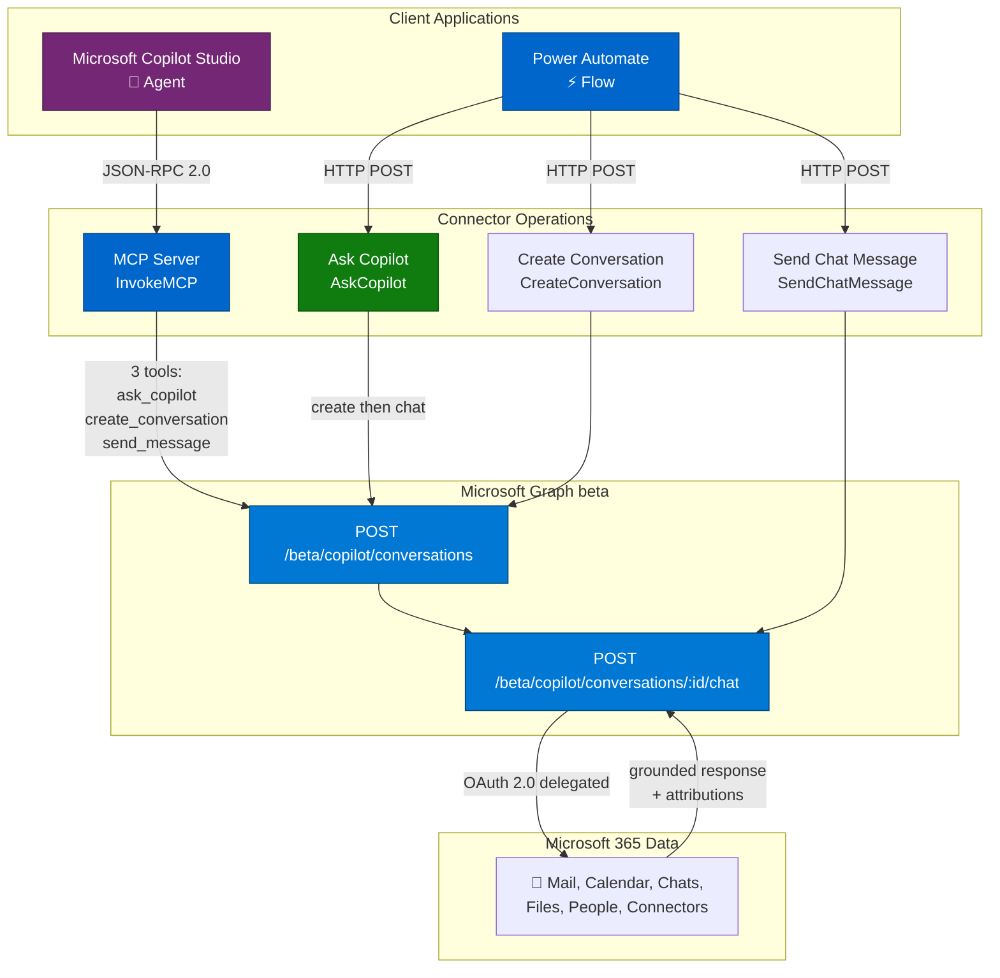
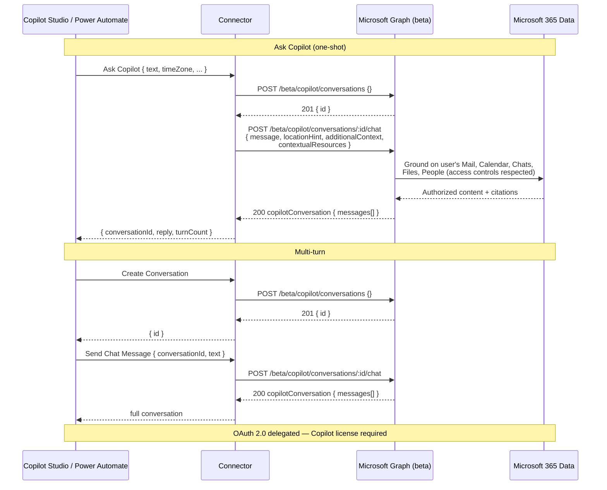

# Microsoft 365 Copilot Chat

Send prompts to Microsoft 365 Copilot and receive grounded, enterprise-aware responses. Create multi-turn conversations, add OneDrive/SharePoint files or free-text as grounding context, and toggle web search. Includes Model Context Protocol (MCP) support for Copilot Studio.

This connector wraps the Microsoft Graph **beta** Copilot Chat API (`/beta/copilot/conversations`).

## Architecture Overview



## Request, Response & Data Flow



## Prerequisites

- A **Microsoft 365 Copilot** license for every user who signs in to the connection.
- A Microsoft Entra ID **app registration** (this connector uses the generic `aad` identity provider with your own client ID and secret).
- **Delegated permissions only** — the Chat API does not support application permissions.

> The Chat API is under the Microsoft Graph `/beta` endpoint and is subject to change. It is not supported for production use by Microsoft.

## Obtaining Credentials

This connector uses OAuth 2.0 (authorization code) with Microsoft Entra ID. Register an app and grant the following **delegated** Microsoft Graph permissions — **all** are required for the Chat API to succeed:

- `Sites.Read.All`
- `Mail.Read`
- `People.Read.All`
- `OnlineMeetingTranscript.Read.All`
- `Chat.Read`
- `ChannelMessage.Read.All`
- `ExternalItem.Read.All`

Steps:

1. In the [Microsoft Entra admin center](https://entra.microsoft.com), register a new application.
2. Add a **Web** redirect URI: `https://global.consent.azure-apim.net/redirect`.
3. Under **API permissions**, add the seven delegated Microsoft Graph permissions above and grant admin consent.
4. Under **Certificates & secrets**, create a client secret. Record the **Application (client) ID** and **secret value**.
5. Set the client ID in `apiProperties.json` (`clientId`) and provide the client secret on the connector's **Security** tab after deployment.

## Operations

| Operation | Description |
| --- | --- |
| **Ask Copilot** (`AskCopilot`) | One-shot: creates a conversation and sends the first prompt, returning Copilot's reply. Best for single questions. |
| **Create Conversation** (`CreateConversation`) | Creates a new conversation and returns its ID for multi-turn chat. |
| **Send Chat Message** (`SendChatMessage`) | Sends a prompt to an existing conversation (by ID) and returns the full conversation with Copilot's response. |
| **Invoke MCP** (`InvokeMCP`) | Model Context Protocol endpoint for Copilot Studio. Exposes `ask_copilot`, `create_conversation`, and `send_message` tools. |

### Grounding options (Ask Copilot / Send Chat Message)

- **Time Zone** — IANA time zone (e.g., `America/New_York`) used to interpret time-relative prompts. Defaults to `UTC`.
- **Additional Context** — a list of free-text strings added as extra grounding.
- **File URLs** — OneDrive/SharePoint file URLs used as context.
- **Enable Web Search** — set to `false` to restrict grounding to enterprise data only (single-turn).

## Example

**Ask Copilot**

```json
{
  "text": "What meetings do I have tomorrow morning?",
  "timeZone": "America/New_York"
}
```

Response:

```json
{
  "conversationId": "0d110e7e-2b7e-4270-a899-fd2af6fde333",
  "reply": "You have 1 meeting tomorrow at 9 AM: Contoso Engineering Standup...",
  "turnCount": 1,
  "conversation": { "id": "0d110e7e-...", "messages": [ ... ] }
}
```

**Multi-turn**: call **Create Conversation**, then call **Send Chat Message** repeatedly with the returned `conversationId`.

## Deployment (PAC CLI)

Because of a known PAC CLI issue deploying OAuth `connectionParameters`, deploy in two steps and configure OAuth in the portal:

```powershell
# 1. Create the connector with the definition, properties, and script
pac connector create `
  --api-definition-file "apiDefinition.swagger.json" `
  --api-properties-file "apiProperties.json" `
  --script-file "script.csx"

# 2. In the Power Platform portal, open the connector's Security tab and set:
#    - Client ID and Client secret (from your app registration)
#    - Ensure the redirect URL matches https://global.consent.azure-apim.net/redirect
```

Deploy to the **Power Platform Demo** environment (ID: `c4f149b0-9f42-e8c4-97d8-bc69b59f971c`).

## Telemetry (optional)

`script.csx` includes an Application Insights logging hook (`LogToAppInsights`) that emits events for requests, Graph calls, MCP tool calls, and errors. It is **disabled by default** — the instrumentation key is a placeholder (`[INSERT_YOUR_APP_INSIGHTS_INSTRUMENTATION_KEY]`) and telemetry is skipped until you set a real key. To enable it, replace the `APP_INSIGHTS_KEY` constant with your Application Insights instrumentation key. Telemetry failures are swallowed and never block an operation.

## Limitations

- **Beta API** — subject to change; not supported for production by Microsoft.
- **Delegated only** — no application (app-only) permission support.
- **License required** — each signing-in user needs a Microsoft 365 Copilot license.
- Streaming (`chatOverStream`) is not exposed; this connector uses the synchronous `chat` endpoint.

## References

- [Microsoft 365 Copilot Chat API overview](https://learn.microsoft.com/en-us/microsoft-365/copilot/extensibility/api/ai-services/chat/overview)
- [Create copilotConversation](https://learn.microsoft.com/microsoft-365/copilot/extensibility/api/ai-services/chat/copilotroot-post-conversations)
- [copilotConversation: chat](https://learn.microsoft.com/microsoft-365/copilot/extensibility/api/ai-services/chat/copilotconversation-chat)
