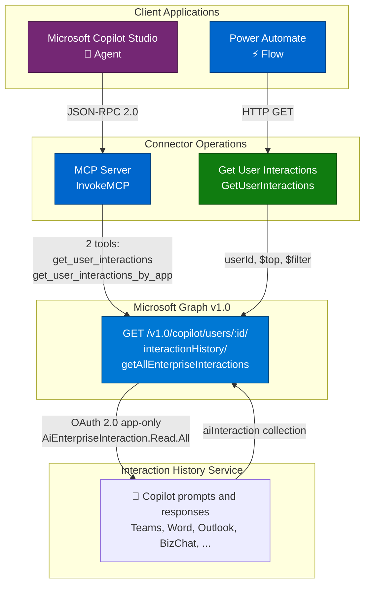
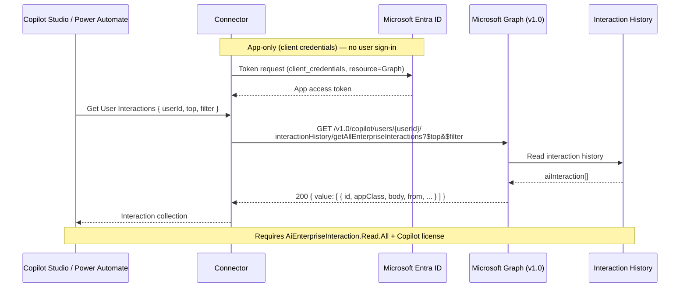

# Microsoft 365 Copilot Interaction Export

Export Microsoft 365 Copilot interaction history — user prompts and Copilot responses across Microsoft 365 apps (Teams, Word, Outlook, BizChat, and more) — using the [Microsoft Graph AI Interaction Export API](https://learn.microsoft.com/en-us/microsoft-365/copilot/extensibility/api/ai-services/interaction-export/overview). Captures user intent, accessed resources, and responses for compliance, auditing, and analytics. Includes Model Context Protocol (MCP) support for Copilot Studio.

This connector wraps the Microsoft Graph **v1.0** `getAllEnterpriseInteractions` API.

## Publisher: Troy Taylor

> **Application permission only.** Unlike the Copilot Chat and Search connectors (which use delegated user sign-in), this API supports **only application (app-only) permissions**. The connection authenticates as the app itself using the **client credentials** flow — no user signs in. Plan your app registration and connection accordingly.

## Architecture Overview



## Request, Response & Data Flow



## Prerequisites

- A Microsoft Entra ID **app registration** with the **`AiEnterpriseInteraction.Read.All`** *application* permission and **admin consent** granted.
- Users whose interactions you export must have a valid **Microsoft 365 Copilot** license with the *Microsoft Copilot with Graph-grounded chat* service plan.

## Obtaining Credentials

This connector authenticates as the application (app-only) using the **client credentials** flow:

1. In the [Microsoft Entra admin center](https://entra.microsoft.com), register a new application.
2. Under **API permissions**, add the **Application** permission **Microsoft Graph → `AiEnterpriseInteraction.Read.All`**, then **grant admin consent**.
3. Under **Certificates & secrets**, create a client secret. Record the **Application (client) ID**, **secret value**, and your **Directory (tenant) ID**.
4. Set the client ID in `apiProperties.json` (`clientId`) and your tenant ID in `apiProperties.json` (`customParameters.tenantId`). A concrete tenant is required — the client-credentials flow cannot use `common`.
5. On the connector's **Security** tab after deployment, provide the client secret. The connection acquires an app-only token — no user signs in.

## Operations

| Operation | Description |
| --- | --- |
| **Get User Interactions** (`GetUserInteractions`) | Get all Copilot interactions for a user, with optional `$top` and `$filter`. |
| **Invoke MCP** (`InvokeMCP`) | Model Context Protocol endpoint for Copilot Studio. Exposes `get_user_interactions` and `get_user_interactions_by_app` tools. |

### Parameters (Get User Interactions)

- **User ID** — the object ID or user principal name of the user whose interactions to export.
- **Top** — the number of interactions to return. Recommended value is `100` for optimal performance.
- **Filter** — an OData filter, e.g., `appClass eq 'IPM.SkypeTeams.Message.Copilot.BizChat'`.

## Example

**Get a user's BizChat interactions**

Request: `userId = 4db02e4b-d144-400e-b194-53253a34c5be`, `$filter = appClass eq 'IPM.SkypeTeams.Message.Copilot.BizChat'`

Response (abridged):

```json
{
  "value": [
    {
      "id": "1732148357313",
      "sessionId": "19:YzBP1kUdkNjFtJnketPYT8kQdQ3A08Y51rDTxE_ENIk1@thread.v2",
      "appClass": "IPM.SkypeTeams.Message.Copilot.BizChat",
      "interactionType": "aiResponse",
      "conversationType": "bizchat",
      "createdDateTime": "2024-11-21T00:19:17.313Z",
      "locale": "en-us",
      "body": { "contentType": "html", "content": "<attachment id=\"4062...\"></attachment>" },
      "from": { "application": { "displayName": "Microsoft 365 Chat", "applicationIdentityType": "bot" } }
    }
  ]
}
```

## Deployment (PAC CLI)

Because of a known PAC CLI issue deploying OAuth `connectionParameters`, deploy in two steps and configure OAuth in the portal:

```powershell
# 1. Create the connector with the definition, properties, and script
pac connector create `
  --api-definition-file "apiDefinition.swagger.json" `
  --api-properties-file "apiProperties.json" `
  --script-file "script.csx"

# 2. In the Power Platform portal, open the connector's Security tab and set:
#    - Client ID and Client secret (from your app registration)
#    (Grant type = client_credentials and the tenant ID are already set in apiProperties.json)
```

Deploy to the **Power Platform Demo** environment (ID: `c4f149b0-9f42-e8c4-97d8-bc69b59f971c`).

## Telemetry (optional)

`script.csx` includes an Application Insights logging hook (`LogToAppInsights`) that emits events for requests, Graph calls, MCP tool calls, and errors. It is **disabled by default** — the instrumentation key is a placeholder (`[INSERT_YOUR_APP_INSIGHTS_INSTRUMENTATION_KEY]`) and telemetry is skipped until you set a real key. To enable it, replace the `APP_INSIGHTS_KEY` constant with your Application Insights instrumentation key. Telemetry failures are swallowed and never block an operation.

## Limitations

- **Application permission only** — delegated (user) sign-in is not supported by this API.
- **Copilot license required** — only interactions for users with a Microsoft 365 Copilot license are returned.
- **No delta** — the delta function is not supported; use `$top` paging (`@odata.nextLink`) to retrieve large histories.
- **Copilot Studio agents excluded** — interactions inside agents created by Copilot Studio are not returned.
- **Not for production (beta caveat)** — only if you switch the connector to the `/beta` endpoint; the `/v1.0` endpoint used here is generally available.

## References

- [AI Interaction Export API overview](https://learn.microsoft.com/en-us/microsoft-365/copilot/extensibility/api/ai-services/interaction-export/overview)
- [aiInteractionHistory: getAllEnterpriseInteractions](https://learn.microsoft.com/microsoft-365/copilot/extensibility/api/ai-services/interaction-export/aiinteractionhistory-getallenterpriseinteractions)
- [Export content with the Microsoft Teams export APIs](https://learn.microsoft.com/en-us/microsoftteams/export-teams-content)
