# Microsoft 365 Copilot Retrieval
The Microsoft 365 Copilot Retrieval API allows you to retrieve relevant text extracts from SharePoint, OneDrive, and Copilot connectors content while respecting access controls and compliance settings. Use this API to ground your generative AI solutions with Microsoft 365 data while optimizing for context recall.

## Architecture Overview

```mermaid
graph TB
    subgraph "Client Applications"
        CS[Microsoft Copilot Studio<br/>🤖 Custom Copilot]
        PA[Power Automate<br/>⚡ Workflow]
    end
    
    subgraph "Connector Operations"
        MCP[MCP Server Operation<br/>InvokeServer]
        Direct[Direct API Operation<br/>RetrieveGroundingData]
    end
    
    subgraph "Microsoft Graph API"
        Graph[Graph API Endpoint<br/>/v1.0 or /beta<br/>/copilot/retrieval]
    end
    
    subgraph "Microsoft 365 Data"
        SPO[📁 SharePoint]
        ODB[📁 OneDrive]
        CC[🔌 Copilot Connectors]
    end
    
    CS -->|MCP Protocol<br/>JSON-RPC 2.0| MCP
    PA -->|HTTP POST| Direct
    
    MCP -->|4 Tools Available:<br/>• retrieve_from_sharepoint<br/>• retrieve_from_onedrive<br/>• retrieve_from_copilot_connectors<br/>• retrieve_multi_source| Graph
    Direct -->|Query Parameters:<br/>queryString, dataSource,<br/>filterExpression, etc.| Graph
    
    Graph -->|OAuth 2.0<br/>Files.Read.All<br/>Sites.Read.All| SPO
    Graph -->|OAuth 2.0<br/>Files.Read.All| ODB
    Graph -->|OAuth 2.0<br/>ExternalItem.Read.All| CC
    
    SPO -->|Text Extracts +<br/>Relevance Scores +<br/>Metadata| Graph
    ODB -->|Text Extracts +<br/>Relevance Scores +<br/>Metadata| Graph
    CC -->|Text Extracts +<br/>Relevance Scores +<br/>Metadata| Graph
    
    Graph -->|retrievalHits Array| MCP
    Graph -->|retrievalHits Array| Direct
    
    MCP -->|MCP Response Format| CS
    Direct -->|JSON Response| PA
    
    style CS fill:#742774,stroke:#4a1a4a,color:#fff
    style PA fill:#da3b01,stroke:#a52a00,color:#fff
    style MCP fill:#0066cc,stroke:#004080,color:#fff
    style Direct fill:#107c10,stroke:#094c09,color:#fff
    style Graph fill:#0078d4,stroke:#004578,color:#fff
    style SPO fill:#036c70,stroke:#024547,color:#fff
    style ODB fill:#0364b8,stroke:#024578,color:#fff
    style CC fill:#8661c5,stroke:#5c3d8f,color:#fff
```

## Request, Response & Data Flow

```mermaid
sequenceDiagram
    participant CS as Copilot Studio
    participant PA as Power Automate
    participant Conn as Connector
    participant Graph as Graph API
    participant Process as Processing Layer
    participant Sec as Security & Filtering
    participant M365 as Microsoft 365
    
    Note over CS,PA: Two Client Types
    
    rect rgb(116, 39, 116, 0.1)
    Note over CS,M365: Copilot Studio → MCP Server Flow
    CS->>Conn: MCP: tools/list
    Conn->>CS: Returns 4 available tools
    CS->>Conn: MCP: tools/call retrieve_from_sharepoint<br/>{query, filter, max_results, metadata_fields}
    Conn->>Graph: POST /copilot/retrieval<br/>{queryString (max 1,500 chars),<br/>dataSource: "sharePoint",<br/>filterExpression (KQL),<br/>maximumNumberOfResults (1-25)}
    Graph->>Process: Parse input parameters
    Process->>Process: Determine retrieval type:<br/>• Semantic + Lexical (.doc/.docx/.pptx/.pdf/.aspx/.one)<br/>• Lexical only (other extensions)
    Process->>Sec: Apply security filters
    Sec->>Sec: Check user permissions<br/>Apply information barriers<br/>Check sensitivity labels
    Sec->>M365: Query authorized content<br/>(SharePoint/OneDrive/Connectors)
    M365->>Sec: Text extracts from authorized content
    Sec->>Graph: Filter results by access control
    Graph->>Graph: Sort by relevance<br/>Limit to max results<br/>Format response
    Graph->>Conn: retrievalHits array:<br/>• Text extracts<br/>• Relevance scores (0.0-1.0)<br/>• Resource metadata<br/>• Sensitivity labels<br/>• Web URLs
    Conn->>CS: MCP response with formatted content
    end
    
    rect rgb(0, 102, 204, 0.1)
    Note over PA,M365: Power Automate → Direct API Flow
    PA->>Conn: RetrieveGroundingData action<br/>{queryString, dataSource,<br/>filterExpression, resourceMetadata,<br/>maximumNumberOfResults}
    Conn->>Graph: POST /copilot/retrieval
    Graph->>Process: Parse input parameters
    Process->>Process: Determine retrieval type:<br/>• Semantic + Lexical (supported files)<br/>• Lexical only (other files)
    Process->>Sec: Apply security filters
    Sec->>Sec: Check user permissions<br/>Apply information barriers<br/>Check sensitivity labels
    Sec->>M365: Query authorized content
    M365->>Sec: Text extracts from authorized content
    Sec->>Graph: Filter results by access control
    Graph->>Graph: Sort by relevance<br/>Limit to max results<br/>Format response
    Graph->>Conn: retrievalHits array:<br/>• Text extracts<br/>• Relevance scores (0.0-1.0)<br/>• Resource metadata<br/>• Sensitivity labels<br/>• Web URLs
    Conn->>PA: JSON response with results
    end
    
    Note over CS,M365: OAuth 2.0 Required: Files.Read.All, Sites.Read.All, ExternalItem.Read.All
```

## Publisher: Troy Taylor

## Prerequisites
- Microsoft 365 Copilot add-on license (required for all users)
- Delegated permissions (work or school account only; application permissions not supported)

## Obtaining Credentials
This connector uses OAuth 2.0 authentication with Microsoft Entra ID. The following permissions are required:
- `Files.Read.All` - Required for SharePoint and OneDrive retrieval
- `Sites.Read.All` - Required for SharePoint retrieval only
- `ExternalItem.Read.All` - Required for Copilot connectors retrieval

## Supported Operations
### Retrieve grounding data
Retrieves relevant text extracts from SharePoint, OneDrive, or Copilot connectors based on a natural language query. Returns up to 25 results with relevance scores and metadata.
### Invoke MCP Server
Invokes the Model Context Protocol (MCP) server for AI agent integration. Provides tools for retrieval operations (retrieve_from_sharepoint, retrieve_from_onedrive, retrieve_from_copilot_connectors, retrieve_multi_source).

## Known Issues and Limitations
- Requires Microsoft 365 Copilot add-on license for all users
- Query string limited to 1,500 characters
- Maximum 25 results per request
- Rate limit: 200 requests per user per hour
- File size limits: .docx/.pptx/.pdf max 512 MB, other extensions max 150 MB
- Semantic retrieval only for .doc, .docx, .pptx, .pdf, .aspx, .one files (SharePoint/OneDrive)
- Invalid KQL syntax executes without scoping (no error returned)
- Results optimized for context recall, not precision/ranking
