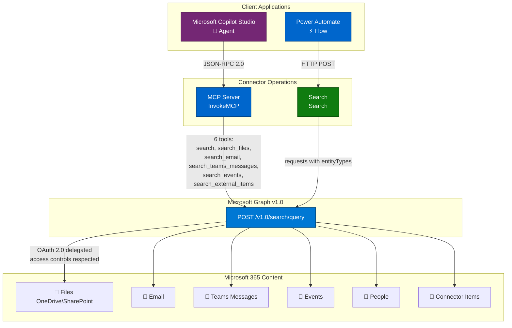
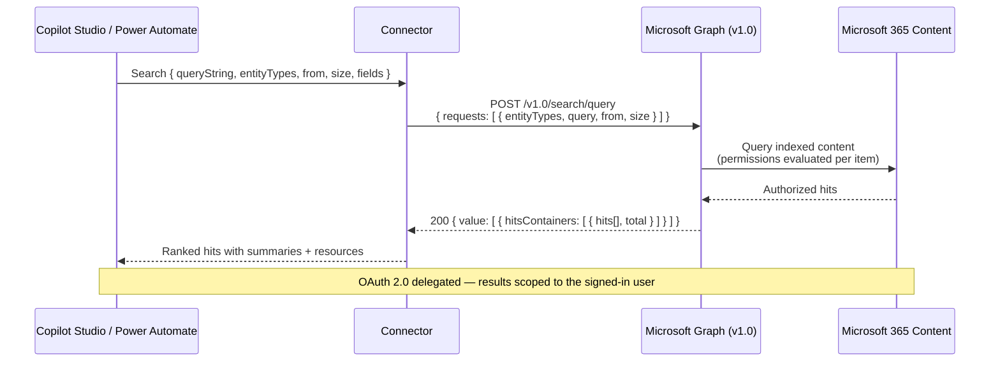

# Microsoft 365 Copilot Search

Search across Microsoft 365 content — files, email, Teams messages, calendar events, SharePoint sites/lists, people, and Copilot connector (external) items — using the [Microsoft Graph Search API](https://learn.microsoft.com/en-us/graph/search-concept-overview). Results respect the signed-in user's access controls. Includes Model Context Protocol (MCP) support for Copilot Studio.

This connector wraps the Microsoft Graph **v1.0** Search API (`POST /v1.0/search/query`).

## Publisher: Troy Taylor

## Architecture Overview



## Request, Response & Data Flow



## Prerequisites

- A Microsoft Entra ID **app registration** (this connector uses the generic `aad` identity provider with your own client ID and secret).
- **Delegated permissions** — searches run in the context of the signed-in user.

## Obtaining Credentials

This connector uses OAuth 2.0 (authorization code) with Microsoft Entra ID. Register an app and grant the **delegated** Microsoft Graph permissions for the entity types you plan to search:

| Entity type | Delegated permission |
| --- | --- |
| `message` (email) | `Mail.Read` |
| `event` (calendar) | `Calendars.Read` |
| `chatMessage` (Teams) | `Chat.Read`, `ChannelMessage.Read.All` |
| `driveItem`, `drive` (files) | `Files.Read.All` |
| `site`, `list`, `listItem` (SharePoint) | `Sites.Read.All` |
| `externalItem` (connectors) | `ExternalItem.Read.All` |
| `person` (people) | `People.Read` |

> Answer types `bookmark`, `acronym`, and `qna` are also supported by the Search API but require `Bookmark.Read.All`, `Acronym.Read.All`, and `QnA.Read.All` respectively. Add these scopes to the app registration and connector if you need them.

Steps:

1. In the [Microsoft Entra admin center](https://entra.microsoft.com), register a new application.
2. Add a **Web** redirect URI: `https://global.consent.azure-apim.net/redirect`.
3. Under **API permissions**, add the delegated Microsoft Graph permissions above and grant admin consent.
4. Under **Certificates & secrets**, create a client secret. Record the **Application (client) ID** and **secret value**.
5. Set the client ID in `apiProperties.json` (`clientId`) and provide the client secret on the connector's **Security** tab after deployment.

## Operations

| Operation | Description |
| --- | --- |
| **Search** (`Search`) | Search one or more entity types with a query, paging, and optional field selection. |
| **Invoke MCP** (`InvokeMCP`) | Model Context Protocol endpoint for Copilot Studio. Exposes `search`, `search_files`, `search_email`, `search_teams_messages`, `search_events`, and `search_external_items` tools. |

### Parameters (Search)

- **Query** — the search text. Supports [Keyword Query Language (KQL)](https://learn.microsoft.com/en-us/sharepoint/dev/general-development/keyword-query-language-kql-syntax-reference), e.g., `budget filetype:xlsx`.
- **Entity Types** — content types to search. **File types (`site`, `drive`, `driveItem`, `list`, `listItem`) must be searched together** and can't be combined with non-file types in one request.
- **From / Size** — paging (zero-based offset and page size).
- **Fields** — specific properties to return per hit.
- **Query Template** — advanced KQL template, e.g., `{searchTerms} CreatedBy:Bob`.
- **Content Sources** — for `externalItem`: the connector connection(s) to query, e.g., `/external/connections/connectionId`.
- **Enable Top Results** — for `message`: return the most relevant results first.

## Example

**Search files**

```json
{
  "queryString": "quarterly budget filetype:xlsx",
  "entityTypes": [ "driveItem" ],
  "size": 10
}
```

Response (abridged):

```json
{
  "value": [
    {
      "searchTerms": [ "quarterly", "budget" ],
      "hitsContainers": [
        {
          "total": 3,
          "moreResultsAvailable": false,
          "hits": [
            {
              "hitId": "01ABC...",
              "rank": 1,
              "summary": "...quarterly <c0>budget</c0> figures...",
              "resource": { "name": "Q3-Budget.xlsx", "webUrl": "https://..." }
            }
          ]
        }
      ]
    }
  ]
}
```

## Deployment (PAC CLI)

Because of a known PAC CLI issue deploying OAuth `connectionParameters`, deploy in two steps and configure OAuth in the portal:

```powershell
# 1. Create the connector with the definition, properties, and script
pac connector create `
  --api-definition-file "apiDefinition.swagger.json" `
  --api-properties-file "apiProperties.json" `
  --script-file "script.csx"

# 2. In the Power Platform portal, open the connector's Security tab and set:
#    - Client ID and Client secret (from your app registration)
#    - Ensure the redirect URL matches https://global.consent.azure-apim.net/redirect
```

Deploy to the **Power Platform Demo** environment (ID: `c4f149b0-9f42-e8c4-97d8-bc69b59f971c`).

## Telemetry (optional)

`script.csx` includes an Application Insights logging hook (`LogToAppInsights`) that emits events for requests, Graph calls, MCP tool calls, and errors. It is **disabled by default** — the instrumentation key is a placeholder (`[INSERT_YOUR_APP_INSIGHTS_INSTRUMENTATION_KEY]`) and telemetry is skipped until you set a real key. To enable it, replace the `APP_INSIGHTS_KEY` constant with your Application Insights instrumentation key. Telemetry failures are swallowed and never block an operation.

## Limitations

- **Delegated only** — this connector is configured for user-context (delegated) search. Application-permission search (for `driveItem`/`listItem`) additionally requires a `region` in the request and is not exposed here.
- **File-type interleaving** — file entity types must all be in the same request; they can't be mixed with non-file types.
- **`person` can't be combined** with any other entity type in a single request — search people on their own.
- Paging values (`from`/`size`) must be consistent when combining multiple entity types. Page size (`size`) maxes at 25 for `message` and `event`; up to 1000 for SharePoint/OneDrive types.

## References

- [Microsoft Search API overview](https://learn.microsoft.com/en-us/graph/search-concept-overview)
- [searchEntity: query](https://learn.microsoft.com/graph/api/search-query?view=graph-rest-1.0)
- [Scope search based on entity types](https://learn.microsoft.com/graph/api/resources/search-api-overview?view=graph-rest-1.0#scope-search-based-on-entity-types)
