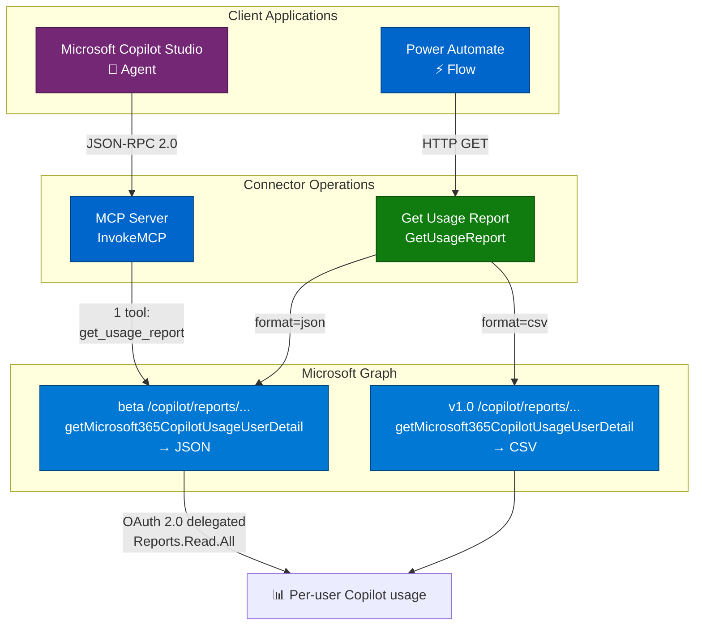
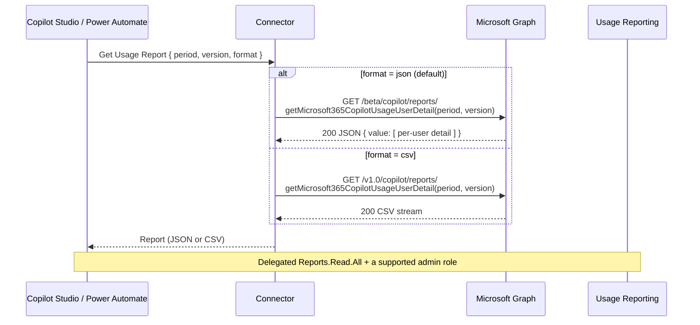

# Microsoft 365 Copilot Usage Reports

Retrieve Microsoft 365 Copilot usage — per-user last-activity dates across Teams, Word, Excel, PowerPoint, Outlook, OneNote, Loop, and Copilot Chat, plus prompt counts and agent activity (v2) — using the [Microsoft Graph Copilot usage reports API](https://learn.microsoft.com/en-us/microsoft-365/copilot/extensibility/api/admin-settings/reports/copilotreportroot-getmicrosoft365copilotusageuserdetail). Includes Model Context Protocol (MCP) support for Copilot Studio.

This connector wraps `getMicrosoft365CopilotUsageUserDetail(period, version)` and returns **JSON** (via the beta Copilot reports namespace) or **CSV** (via v1.0).

## Publisher: Troy Taylor

## Architecture Overview



## Request, Response & Data Flow



## Prerequisites

- A Microsoft Entra ID **app registration** (this connector uses the generic `aad` identity provider with your own client ID and secret).
- The signing-in user must hold a supported **admin role** — for example **Reports Reader**, **Usage Summary Reports Reader**, **AI Administrator**, or **Global Reader**.

## Obtaining Credentials

This connector uses OAuth 2.0 (authorization code) with Microsoft Entra ID and the **`Reports.Read.All`** delegated permission:

1. In the [Microsoft Entra admin center](https://entra.microsoft.com), register a new application.
2. Add a **Web** redirect URI: `https://global.consent.azure-apim.net/redirect`.
3. Under **API permissions**, add the delegated Microsoft Graph permission **`Reports.Read.All`** and grant admin consent.
4. Under **Certificates & secrets**, create a client secret. Record the **Application (client) ID** and **secret value**.
5. Set the client ID in `apiProperties.json` (`clientId`) and provide the client secret on the connector's **Security** tab after deployment.

## Operations

| Operation | Description |
| --- | --- |
| **Get Usage Report** (`GetUsageReport`) | Get per-user Copilot usage for a period, as JSON (default) or CSV. |
| **Invoke MCP** (`InvokeMCP`) | Model Context Protocol endpoint for Copilot Studio. Exposes the `get_usage_report` tool (JSON). |

### Parameters (Get Usage Report)

- **Period** — the number of previous days to aggregate. `v1` supports `D7, D30, D90, D180, ALL`; `v2` supports `D7, D28, D90, D180, ALL`.
- **Version** — `v1` or `v2` (default). **v2** adds prompt counts (all apps, Copilot Chat work/web), active usage days, Microsoft 365 Copilot / Edge / Copilot Agent last-activity dates.
- **Format** — `json` (default) or `csv`.

## Example

**Get the last 7 days as JSON (v2)**

Request: `period = D7`, `version = v2`, `format = json`

Response (abridged):

```json
{
  "value": [
    {
      "reportRefreshDate": "2026-07-23",
      "userPrincipalName": "avery@zava.com",
      "displayName": "Avery Howard",
      "lastActivityDate": "2026-07-22",
      "copilotChatLastActivityDate": "2026-07-22",
      "microsoftTeamsCopilotLastActivityDate": "2026-07-21",
      "wordCopilotLastActivityDate": "2026-07-20",
      "copilotActivityUserDetailsByPeriod": [ { "reportPeriod": 7 } ]
    }
  ]
}
```

> **v2 fields:** When `version=v2` (the default), the response includes additional data beyond the named outputs — prompt counts (all apps, Copilot Chat work/web) and active usage days appear inside each `copilotActivityUserDetailsByPeriod` entry, and extra last-activity dates (Copilot Chat work/web, Microsoft 365 Copilot, Edge, Copilot Agent) appear at the top level. These pass through in the JSON; the exact property names aren't published in the Graph docs, so they aren't declared as named outputs here.

## Deployment (PAC CLI)

Because of a known PAC CLI issue deploying OAuth `connectionParameters`, deploy in two steps and configure OAuth in the portal:

```powershell
# 1. Create the connector with the definition, properties, and script
pac connector create `
  --api-definition-file "apiDefinition.swagger.json" `
  --api-properties-file "apiProperties.json" `
  --script-file "script.csx"

# 2. In the Power Platform portal, open the connector's Security tab and set:
#    - Client ID and Client secret (from your app registration)
#    - Ensure the redirect URL matches https://global.consent.azure-apim.net/redirect
```

Deploy to the **Power Platform Demo** environment (ID: `c4f149b0-9f42-e8c4-97d8-bc69b59f971c`).

## Telemetry (optional)

`script.csx` includes an Application Insights logging hook (`LogToAppInsights`) that emits events for requests, Graph calls, MCP tool calls, and errors. It is **disabled by default** — the instrumentation key is a placeholder (`[INSERT_YOUR_APP_INSIGHTS_INSTRUMENTATION_KEY]`) and telemetry is skipped until you set a real key. To enable it, replace the `APP_INSIGHTS_KEY` constant with your Application Insights instrumentation key. Telemetry failures are swallowed and never block an operation.

## Limitations

- **JSON comes from the beta namespace** — the v1.0 Copilot reports endpoint returns CSV, so this connector routes JSON requests to `/beta/copilot/reports/...`. APIs under `/beta` are subject to change.
- **Licensed users only** — the report returns usage only for users with a Microsoft 365 Copilot license. Unlicensed Copilot Chat usage isn't available here (see the admin center Copilot Chat Usage report or Purview audit logs).
- **No per-user prompt counts across tenants** — per-user prompt counts are aggregated per the report version; cross-tenant per-user prompt tracking isn't supported.
- **Admin role required** — the signed-in user must hold a supported reports/admin role, not just the app permission.
- **Data anonymization** — usage report data may be anonymized depending on the tenant's admin center reports privacy setting.

## References

- [copilotReportRoot: getMicrosoft365CopilotUsageUserDetail](https://learn.microsoft.com/en-us/microsoft-365/copilot/extensibility/api/admin-settings/reports/copilotreportroot-getmicrosoft365copilotusageuserdetail)
- [Microsoft 365 Copilot usage report (admin center)](https://learn.microsoft.com/en-us/microsoft-365/admin/activity-reports/microsoft-365-copilot-usage)
- [Authorization for APIs to read Microsoft 365 usage reports](https://learn.microsoft.com/en-us/graph/reportroot-authorization)
