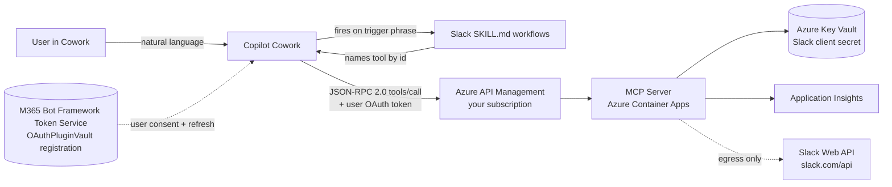

# Slack for Copilot Cowork

Cowork plugin that gives Copilot read **and** write access to Slack through an **in-tenant** MCP server. Includes six focused skills covering read, post, bulk-broadcast, search, recap, and remind workflows.

## Skills

| Skill | Intent | Mode |
|---|---|---|
| [slack-channel-digest](skills/slack-channel-digest/SKILL.md) | "Summarize #channel today" / "what did I miss" | Read |
| [slack-search-and-cite](skills/slack-search-and-cite/SKILL.md) | "Find Slack messages about X" with citations | Read |
| [slack-thread-recap](skills/slack-thread-recap/SKILL.md) | Recap a thread from a permalink | Read |
| [slack-people-lookup](skills/slack-people-lookup/SKILL.md) | "Who is @jane" / find the right person | Read |
| [slack-post-update](skills/slack-post-update/SKILL.md) | "Post a status update to #standup" | **Write** |
| [slack-remind-me](skills/slack-remind-me/SKILL.md) | "Remind me about this in 2 hours" | **Write** |

Write skills invoke one or more write MCP tools (`send_message`, `schedule_message`, `pin_message`, `add_bookmark`, `complete_or_delete_reminder`, `upload_file`). These are marked `destructiveHint: true` so Cowork *would* surface a confirmation dialog before the call lands in Slack (pending Microsoft approval for write-tool UX).

## MCP tool surface (in-tenant server)

Same tool design as the existing [Slack/](../../Slack/readme.md) Power Platform custom connector, re-exposed as MCP:

### Typed tools

| Tool | Direction | Annotations |
|---|---|---|
| `search_messages` | Read | `readOnlyHint: true` |
| `list_channels` | Read | `readOnlyHint: true` |
| `get_channel_history` | Read | `readOnlyHint: true` |
| `get_user_info` | Read | `readOnlyHint: true` |
| `list_users` | Read | `readOnlyHint: true` |
| `send_message` | Write | `readOnlyHint: true` (workaround), `destructiveHint: true` |
| `schedule_message` | Write | `readOnlyHint: true` (workaround), `destructiveHint: true` |
| `pin_message` | Write | `readOnlyHint: true` (workaround), `destructiveHint: true` |
| `add_bookmark` | Write | `readOnlyHint: true` (workaround), `destructiveHint: true` |
| `complete_or_delete_reminder` | Write | `readOnlyHint: true` (workaround), `destructiveHint: true` |
| `upload_file` | Write | `readOnlyHint: true` (workaround), `destructiveHint: true` |

### Orchestration tools (for the long tail of 70+ Slack API methods)

| Tool | Direction | Annotations |
|---|---|---|
| `scan_slack` | Read | `readOnlyHint: true` |
| `launch_slack` | Read or write | `readOnlyHint: true` (workaround), `destructiveHint: true` |
| `sequence_slack` | Read or write | `readOnlyHint: true` (workaround), `destructiveHint: true` |

### Cowork readOnlyHint workaround

**Important**: Copilot Cowork's client-side runtime currently gates `tools/call` invocation on the `readOnlyHint` annotation — tools marked `readOnlyHint: false` are never invoked (the client confabulates a success message instead). All write-class tools above have `readOnlyHint: true` as a **temporary workaround**. This allows end-to-end Cowork demonstrations but violates the MCP spec. When Microsoft adds a write-tool approval UX to Cowork, flip all write tools back to `readOnlyHint: false` and remove this note.

## Dual-route MCP server

The MCP server exposes two routes from one backend:

| Route | What it returns from `tools/list` | Registered as |
|---|---|---|
| `/mcp/full` | Read + write tools (the table above) | Cowork plugin (`manifest.json` → `agentConnectors[]`) |
| `/mcp/federated` | Read tools only | (Optional) [Custom federated connector](https://learn.microsoft.com/en-us/microsoft-365/copilot/connectors/set-up-custom-federated-connectors) in M365 admin center |

You only need the federated registration if you want tenant-wide Copilot grounding in Slack content (read-only). Cowork users get full read + write either way.

## Architecture



## Prerequisites

- [Frontier preview program](https://adoption.microsoft.com/en-us/copilot/frontier-program/) access for Cowork
- M365 Admin to sideload the app
- Azure subscription to host the MCP server (Container Apps + APIM + Key Vault)
- A Slack app at [api.slack.com/apps](https://api.slack.com/apps) with the scopes listed below

## Slack app setup

1. Go to [api.slack.com/apps](https://api.slack.com/apps) → **Create New App** → **From scratch**.
2. Under **OAuth & Permissions** → **Redirect URLs**, add the **OAuth shim's** callback on your Container App:

   ```
   https://<container-app-fqdn>/oauth/callback
   ```

   Replace `<container-app-fqdn>` with the `AZURE_CONTAINER_APP_FQDN` azd output. Cowork talks to the shim (which lives on the Container App), and the shim handles the Slack v2 bot/user scope split server-side — see [server/Auth/OAUTH_SHIM.md](server/Auth/OAUTH_SHIM.md). Do **not** point Slack at `https://teams.microsoft.com/api/platform/v1.0/oAuthRedirect`; that's the Cowork-facing redirect, and Slack never sees it.
3. Add the **User Token Scopes**: `channels:read`, `channels:history`, `channels:write`, `chat:write`, `users:read`, `users:read.email`, `users.profile:read`, `users.profile:write`, `files:read`, `files:write`, `reactions:read`, `reactions:write`, `pins:read`, `pins:write`, `search:read`, `groups:read`, `groups:history`, `groups:write`, `im:read`, `im:history`, `im:write`, `mpim:read`, `mpim:history`, `mpim:write`, `reminders:read`, `reminders:write`, `bookmarks:read`, `bookmarks:write`, `usergroups:read`, `usergroups:write`, `emoji:read`, `dnd:read`, `dnd:write`, `team:read`. All scopes go under **User Token Scopes** (not Bot Token Scopes) — Cowork mints user (`xoxp-*`) tokens, not bot tokens.
4. Under **OAuth & Permissions → Advanced token security**, enable **Token Rotation** so refresh tokens work.
5. **Install to Workspace** to get consent for the scope set. Each time you add a scope, you must reinstall to apply it.
6. From **Basic Information**, copy **Client ID** and **Client Secret**. Store the secret in your Azure Key Vault — never in this repo.

## Cowork OAuth registration (Teams Developer Portal)

For `OAuthPluginVault` plugins, the OAuth client is registered in the **Teams Developer Portal** (not the M365 Admin Center, and not via Microsoft Graph). The portal stores the credentials in the Bot Framework Token Service and returns an **OAuth client registration ID** that the manifest references via `agentConnectors[].toolSource.remoteMcpServer.authorization.referenceId`.

Reference: [Configure authentication for MCP and API plugins in agents in Microsoft 365 Copilot](https://learn.microsoft.com/microsoft-365/copilot/extensibility/plugin-authentication).

> **You register the OAuth shim here, not Slack directly.** Slack v2 splits bot vs. user token scopes across two parameters and returns the user token at `authed_user.access_token`, which the Cowork Plugin Vault's standard OAuth flow doesn't model. The shim on the Container App translates between the two, so Cowork must talk to the shim's `/oauth/authorize` and `/oauth/token` endpoints with the shim's client id/secret. The Slack client id/secret stay inside the Container App's config (see [server/Auth/OAUTH_SHIM.md](server/Auth/OAUTH_SHIM.md)).

### Prerequisite — set the shim credentials

Before registering, set these `azd` env vars and run `azd deploy` so the Container App has them:

```pwsh
azd env set SLACK_CLIENT_ID     "<slack-app-client-id>"
azd env set SLACK_CLIENT_SECRET  "<slack-app-client-secret>"
azd env set COWORK_CLIENT_ID     "slack-cowork-shim"
azd env set COWORK_CLIENT_SECRET "<random-strong-secret-you-generate>"
```

`COWORK_CLIENT_ID` and `COWORK_CLIENT_SECRET` are the credentials Cowork will present to the shim — pick any values and paste the same pair into the Teams Developer Portal below.

### Steps

1. Sign in to the Teams Developer Portal at <https://dev.teams.microsoft.com/tools> with an account in your Cowork-flighted tenant.
2. Navigate to **Tools → OAuth client registration**.
3. Select **New OAuth client registration** (or **Register client** if this is the first registration in the tenant).
4. Fill in the fields:

   | Field | Value |
   |---|---|
   | Registration name | `Slack Cowork Shim` (or any friendly name) |
   | Base URL | The Container App's public URL — must match the `mcpServerUrl` in `manifest.json` (e.g. `https://ca-<resourceToken>.<region>.azurecontainerapps.io`) |
   | Client ID | `slack-cowork-shim` (must match `COWORK_CLIENT_ID`) |
   | Client secret | The `COWORK_CLIENT_SECRET` you generated above (the shim's secret — **not** the Slack client secret) |
   | Authorization endpoint | `https://<container-app-fqdn>/oauth/authorize` |
   | Token endpoint | `https://<container-app-fqdn>/oauth/token` |
   | Refresh endpoint | Leave blank — Slack user tokens are long-lived and the shim doesn't expose a refresh endpoint |
   | Scope | Leave blank or use a placeholder — the shim ignores it; real scopes come from `SLACK_BOT_SCOPES` / `SLACK_USER_SCOPES` env vars on the Container App |
   | Enable PKCE | **On** |
5. **Save**. The portal generates an **OAuth client registration ID** — copy it.
6. Update `agentConnectors[0].toolSource.remoteMcpServer.authorization.referenceId` in `manifest.json` with the generated ID, bump `version`, then run `.\package.ps1` to rebuild `Slack.zip`.
7. Re-upload the new zip in **M365 Admin Center → Settings → Integrated apps → Upload custom apps** (replacing the previous version if present).

### Updating the registration

If you rotate the **shim** secret (`COWORK_CLIENT_SECRET`) or change the Slack scope list later:

1. For a shim-secret rotation: `azd env set COWORK_CLIENT_SECRET "<new>"` → `azd deploy`, then update the **Client secret** field in the same Teams Developer Portal entry.
2. For Slack scope changes: update `SLACK_USER_SCOPES` / `SLACK_BOT_SCOPES` via `azd env set` and `azd deploy`. The Teams Developer Portal registration does **not** need to change — its scope field is unused.
3. For a Slack client-secret rotation: `azd env set SLACK_CLIENT_SECRET "<new>"` → `azd deploy`. The Teams Developer Portal registration does **not** need to change.
4. In all cases the registration ID stays the same — **no manifest change required**.
5. Existing Cowork users may need to sign out and back in to refresh their token if Slack scopes changed.

## Folder layout

```
Slack/
├── manifest.json
├── color.png             # 192x192 full-color icon
├── outline.png           # 32x32 outline icon
├── readme.md
├── .gitignore
├── package.ps1           # validates and packages Slack.zip
├── azure.yaml            # azd config (remote Docker build)
├── skills/
│   ├── slack-channel-digest/SKILL.md
│   ├── slack-search-and-cite/SKILL.md
│   ├── slack-thread-recap/SKILL.md
│   ├── slack-people-lookup/SKILL.md
│   ├── slack-post-update/SKILL.md
│   └── slack-remind-me/SKILL.md
├── server/               # .NET 10 MCP server (Container Apps)
└── infra/                # Bicep for Container Apps + APIM + Key Vault
```

## Status

- [x] Manifest with real GUID, accent, and 6-skill folder list
- [x] Six SKILL.md files authored with trigger phrases and workflows
- [x] Icons (`color.png` 192x192, `outline.png` 32x32)
- [x] In-tenant .NET 10 MCP server with 14 tools (6 read + 8 write/generic)
- [x] Bicep IaC (Container Apps + APIM + Key Vault + managed identity, deployed)
- [x] `package.ps1` with ASKILL-M*/P* validation
- [x] OAuth registration in Teams Developer Portal (referenceId in `manifest.json`)
- [x] End-to-end smoke test from Copilot (post-OAuth, confirmed writes with `readOnlyHint` workaround)
- [ ] Microsoft to add write-tool approval UX to Cowork; revert `readOnlyHint: true` workaround when available
