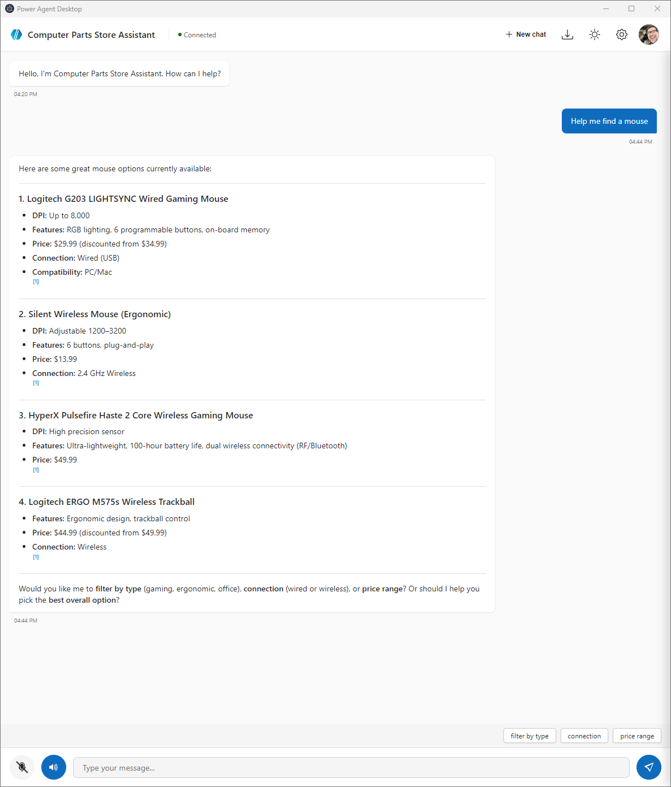

# Power Agent Desktop

A native Windows desktop client for Microsoft Copilot Studio agents with voice-enabled AI interactions. Built with Electron and the M365 Agents SDK, it provides a rich conversational experience with adaptive cards, speech-to-text input, text-to-speech responses, and hands-free "Hey Copilot" wake word activation. Supports the Model Context Protocol (MCP) for integration with other AI tools and can be packaged as MSIX for enterprise deployment.



## Features

- ✅ **Fluent UI Design** - Native Windows look with light/dark theme toggle
- ✅ **M365 Agents SDK** - Official Microsoft SDK for Copilot Studio
- ✅ **MSAL.js Authentication** - Microsoft Authentication Library with persistent cache
- ✅ **Adaptive Cards** - Rich UI rendering (Microsoft SDK v3.0.5)
- ✅ **Voice I/O** - Azure Speech SDK for speech-to-text and text-to-speech
- ✅ **Wake Word** - Say "Hey Copilot" to activate voice input hands-free
- ✅ **Smart Mic Selection** - Automatically prefers raw microphones over virtual audio devices
- ✅ **Device Code Auth** - Secure federated authentication
- ✅ **Markdown Rendering** - Full markdown support with inline citations
- ✅ **Conversation History** - IndexedDB persistence with export
- ✅ **Multiple Agents** - Switch between different Copilot Studio agents
- ✅ **Dynamic Agent Name** - Automatically retrieves and displays agent name from Copilot Studio
- ✅ **System Tray** - Minimize to tray with quick actions
- ✅ **Auto-Update** - electron-updater for seamless updates
- ✅ **MCP Protocol** - Expose agent to other tools

## Quick Start

### 1. Prerequisites

```powershell
# Node.js 18+ required
node --version

# Optional: Install WinApp CLI for MSIX packaging
winget install Microsoft.WinAppCli
```

### 2. Configure Environment

Create `.env` file in `templates/src/`:

```env
# ===== Copilot Studio Connection =====
# Option 1: Direct Connect URL (from Copilot Studio > Channels > Native app)
directConnectUrl=https://YOUR_REGION.api.powerplatform.com/...

# Option 2: Manual Configuration (from Settings > Advanced > Metadata)
environmentId=your-environment-id
schemaName=your-agent-schema-name

# ===== Azure Entra ID App Registration =====
AZURE_TENANT_ID=your-tenant-id
AZURE_CLIENT_ID=your-client-id
COPILOT_AUTH_METHOD=entraId

# ===== Voice I/O (Optional) =====
# Create Azure Speech resource: https://portal.azure.com > Cognitive Services > Speech
AZURE_SPEECH_RESOURCE_ID=/subscriptions/xxx/resourceGroups/xxx/providers/Microsoft.CognitiveServices/accounts/xxx
AZURE_SPEECH_REGION=eastus

# ===== Settings =====
COPILOT_REQUIRE_SIGNIN=true
COPILOT_USE_LOCAL_AI=true
```

### 3. Install & Build

```powershell
cd templates/src

# Install dependencies
npm install

# Build all (MCP server + Electron)
npm run build:all
```

### 4. Run

```powershell
npm run start:desktop
```

The app will:
1. Launch the Electron window
2. Start the MCP server as a child process
3. Present device code for authentication
4. Auto-start conversation once authenticated

---

## Azure App Registration Setup

### 1. Create App Registration

1. Go to [Azure Portal](https://portal.azure.com) > **App registrations** > **New registration**
2. Name: `Power Agent Desktop`
3. Supported account types: **Single tenant** (your org only)
4. Redirect URI: **Public client/native** > `http://localhost`

### 2. Configure API Permissions

Add these permissions:

| API | Permission | Type |
|-----|------------|------|
| Microsoft Graph | `User.Read` | Delegated |
| Power Platform API | `Copilot Studio.Copilots.Invoke` | Delegated |

Grant admin consent for your organization.

### 3. Enable Public Client

**Authentication** > **Advanced settings** > **Allow public client flows** > **Yes**

### 4. Copy IDs

- **Application (client) ID** → `appClientId`
- **Directory (tenant) ID** → `tenantId`

---

## Authentication

This app uses **device code flow** for federated authentication:

1. App displays a code (e.g., `ABC123XYZ`)
2. User visits https://microsoft.com/devicelogin
3. User enters the code and signs in
4. Token is stored in Windows Credential Manager
5. Subsequent launches use cached token (up to 90 days)

### Environment Variables

```env
# Required
appClientId=your-client-id
tenantId=your-tenant-id

# Connection (choose one)
directConnectUrl=connection-string-from-copilot-studio
# OR
environmentId=env-id
schemaName=schema-name

# Settings
COPILOT_REQUIRE_SIGNIN=true
COPILOT_USE_LOCAL_AI=true
```

---

## Voice I/O

Voice input and text-to-speech are powered by **Azure Speech SDK** with unified MSAL authentication.

### Features

- 🎤 **Speech-to-Text**: Click the microphone button to dictate messages
- �️ **Wake Word**: Say "Hey Copilot" to activate voice input hands-free
- 🔊 **Text-to-Speech**: Toggle TTS to hear agent responses read aloud
- 🔐 **MSAL Integration**: Uses same Entra ID auth as Copilot Studio (no separate API keys)
- 🎛️ **Smart Mic Selection**: Automatically prefers raw microphones over virtual audio devices (Elgato Wave Link, VB-Audio, etc.)

### Setup

1. **Create Azure Speech Resource**
   - Go to [Azure Portal](https://portal.azure.com) > Create a resource > "Speech"
   - Choose a region (e.g., `eastus`)
   - Note the **Resource ID** (from Overview > JSON View)

2. **Add API Permission**
   In your Azure App Registration, add:
   | API | Permission | Type |
   |-----|------------|------|
   | Azure Cognitive Services | `user_impersonation` | Delegated |

3. **Configure Environment**
   ```env
   AZURE_SPEECH_RESOURCE_ID=/subscriptions/xxx/resourceGroups/xxx/providers/Microsoft.CognitiveServices/accounts/your-speech-resource
   AZURE_SPEECH_REGION=eastus
   ```

### Usage

- **Mic Button**: Click to start voice input, click again to stop
- **Wake Word**: Enable in Settings, then say "Hey Copilot" - mic button shows a blue dot when listening
- **TTS Toggle**: Click speaker button to enable/disable speech synthesis
- Agent responses are automatically read aloud when TTS is enabled

---

## MCP Tools

The MCP server exposes these tools:

| Tool | Description |
|------|-------------|
| `chat_with_agent` | Send messages to the Copilot Studio agent |
| `get_agent_capabilities` | Query what the agent can do |
| `start_conversation` | Begin a new conversation session (returns agent name) |
| `sign_in` | Initiate authentication flow |
| `clear_credentials` | Sign out and clear cached tokens |
| `get_agent_details` | Fetch agent name/icon from Dataverse |
| `render_adaptive_card` | Render Microsoft Adaptive Cards |
| `render_product_grid` | Display products in a visual card grid |
| `render_widget` | Render custom HTML in a sandboxed widget |

### Agent Name Resolution

The app automatically retrieves the agent's display name from conversation activities. Internal schema names like `tst_computerPartsStoreAssistant` are formatted to readable names like "Computer Parts Store Assistant".

### Use with External MCP Clients

Add to Claude Desktop's `claude_desktop_config.json`:

```json
{
  "mcpServers": {
    "power-agent": {
      "command": "node",
      "args": ["C:/path/to/templates/src/dist/mcp-server/index.js"]
    }
  }
}
```

---

## Packaging Options

### Option A: Electron Builder (Recommended)

```powershell
# Build installer
npm run build:installer

# Creates: dist/Power Agent Desktop Setup.exe
```

### Option B: WinApp CLI (MSIX)

Use WinApp CLI when you need:
- **Package Identity** for Windows AI APIs
- **Microsoft Store** distribution
- **Enterprise sideloading** with MSIX

```powershell
# Initialize WinApp
npx winapp init

# Create debug identity for testing
npx winapp create-debug-identity

# Build MSIX package
npx winapp pack
```

---

## Project Structure

```
templates/src/
├── package.json              # Dependencies
├── tsconfig.json             # TypeScript (ESM)
├── tsconfig.desktop.json     # TypeScript (Electron/CommonJS)
├── .env                      # Environment variables
├── mcp-server/
│   └── index.ts              # MCP server entry point
├── agent/
│   ├── copilot-agent.ts      # M365 Agents SDK client
│   └── auth-service.ts       # Device code auth + keytar
├── desktop/
│   ├── main.ts               # Electron main process
│   ├── preload.ts            # Secure IPC bridge
│   ├── index.html            # Fluent UI chat interface
│   └── package.json          # CommonJS config
├── ui/
│   └── agent-ui.ts           # MCP Apps UI components
├── assets/                   # App icons
└── dist/                     # Build output
```

---

## Technology Stack

| Component | Technology | Version |
|-----------|------------|---------|
| Desktop Framework | Electron | 33.x |
| UI Design | Fluent UI Web Components | 2.6.1 |
| Cards Rendering | Microsoft Adaptive Cards SDK | 3.0.5 |
| Agent SDK | @microsoft/agents-copilotstudio-client | 1.2.3 |
| Authentication | @azure/msal-node | 2.16.x |
| Voice I/O | Azure Speech SDK | latest |
| MCP Protocol | @modelcontextprotocol/sdk | 1.1.0 |
| Auto-Update | electron-updater | 6.x |
| Markdown | marked.js | latest |

---

## Troubleshooting

### "Authentication failed"
- Verify `appClientId` and `tenantId` in `.env`
- Ensure **Power Platform API** permission is granted
- Check that "Allow public client flows" is enabled

### "MCP server not connecting"
- Run `npm run build:all` to rebuild
- Check that `.env` is in the `templates/src/` directory

### "Voice recognition not working"
- If using virtual audio devices (Elgato Wave Link, VB-Audio Cable), the app automatically selects raw microphones
- Check that Azure Speech permissions are granted in your app registration
- Verify `AZURE_SPEECH_RESOURCE_ID` and `AZURE_SPEECH_REGION` in `.env`

### "Adaptive Cards not rendering"
- Cards must include `"type": "AdaptiveCard"` and `"version": "1.5"`
- Check browser console for SDK errors

### Clear cached credentials
```powershell
# Windows Credential Manager
cmdkey /delete:power-agent-desktop
```

---

## Learn More

- [Microsoft Adaptive Cards](https://adaptivecards.io/)
- [M365 Agents SDK](https://learn.microsoft.com/microsoft-copilot-studio/publication-integrate-web-or-native-app-m365-agents-sdk)
- [Fluent UI Web Components](https://github.com/microsoft/fluentui)
- [Copilot Studio Documentation](https://learn.microsoft.com/microsoft-copilot-studio/)
- [WinApp CLI](https://github.com/microsoft/WinAppCli)
- [Electron Documentation](https://www.electronjs.org/docs)
